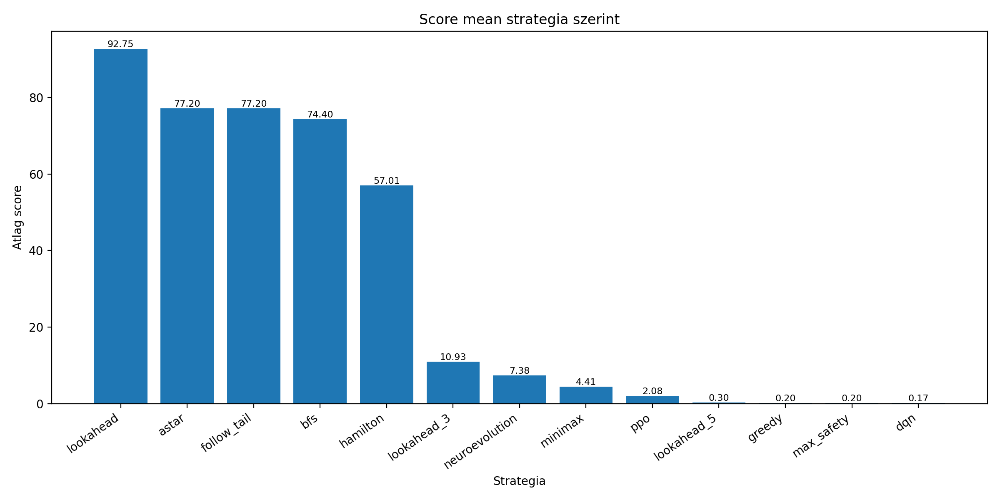
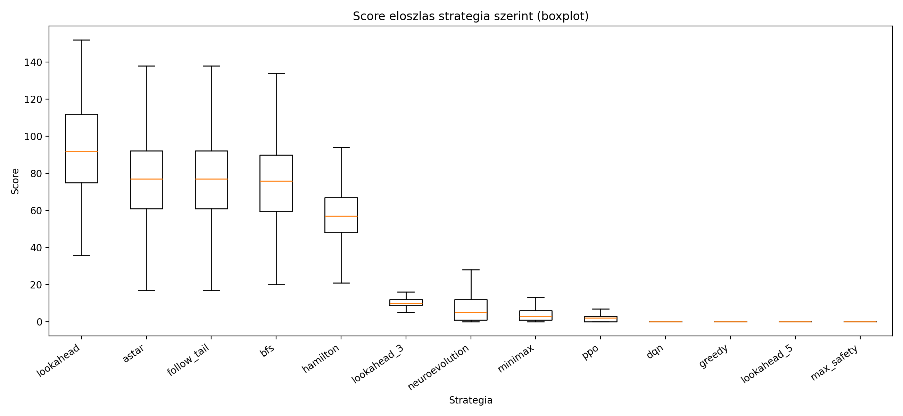
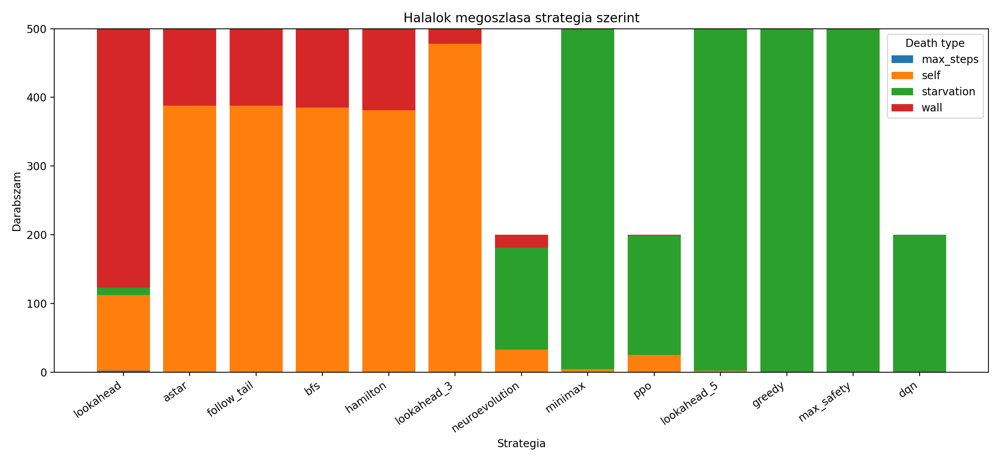
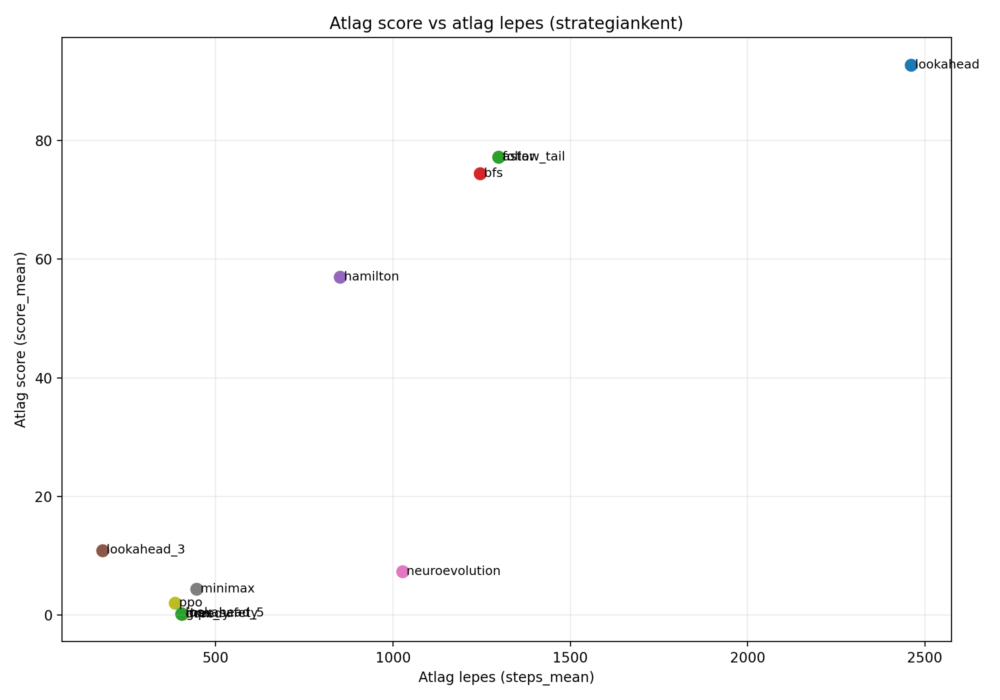

<!-- 1. oldal: román címoldal -->
<div class="front-matter title-page-ro">

<p class="tp-20"><strong>Universitatea „Sapientia” din Cluj-Napoca</strong></p>
<p class="tp-14">FACULTATEA DE ȘTIINȚE TEHNICE ȘI UMANISTE,<br>TÎRGU-MUREȘ</p>
<p class="tp-14">SPECIALIZAREA CALCULATOARE</p>

<p class="tp-24">Aplicarea inteligenței artificiale pentru optimizarea jocurilor pe calculator</p>

<p class="tp-20"><strong>PROIECT DE DIPLOMĂ</strong></p>

<div class="tp-spacer"></div>

<div class="tp-footer-row">
<div class="tp-footer-col">
<p>Coordonator științific:</p>
<p>Ș.l.dr. Kovács Lehel István</p>
</div>
<div class="tp-footer-col">
<p>Absolvent:</p>
<p>György Ákos</p>
</div>
</div>

<p class="tp-18">2026</p>

</div>

<div class="page-break"></div>

<!-- 2. oldal: román kivonat (Extras) -->
<div class="front-matter abstract-page">

<p class="abstract-title">Aplicarea inteligenței artificiale pentru optimizarea jocurilor pe calculator</p>

<p class="abstract-heading">Abstract</p>

<p>Această lucrare prezintă dezvoltarea unui sistem software integrat pentru jocul Snake, cu scopul comparării strategiilor de control clasice și bazate pe inteligență artificială. Soluția este implementată într-o arhitectură monorepo și include trei componente principale: un frontend React + TypeScript pentru interfața jocului și experiența utilizatorului, un backend Node.js + Express + SQLite pentru autentificare și stocarea rezultatelor, respectiv un serviciu AI Python FastAPI pentru decizii în timp real prin WebSocket.</p>

<p>Stratul AI conține atât strategii euristice (A*, BFS, Hamilton, lookahead, minimax, max safety), cât și strategii învățate (DQN, PPO, Neuroevolution/NEAT), toate integrate printr-o interfață unificată de tip „stare de joc in, direcție out”. Pentru evaluare obiectivă, proiectul utilizează un benchmark reproductibil, cu seed-uri controlate, care măsoară scorul mediu și median, numărul de pași, cauzele de terminare și procentul de atingere a primului obiectiv (hrană). Rezultatele arată că, în configurația documentată, strategiile euristice oferă performanțe mai stabile decât modelele învățate, subliniind importanța alegerii funcției de recompensă, a reprezentării stării și a parametrilor de antrenare.</p>

</div>

<div class="page-break"></div>

<!-- 3. oldal: magyar címoldal -->
<div class="front-matter title-page-hu">

<p class="tp-20"><strong>Sapientia Erdélyi Magyar Tudományegyetem</strong></p>
<p class="tp-14">MAROSVÁSÁRHELYI KAR</p>
<p class="tp-14">SZÁMÍTÁSTECHNIKA SZAK</p>

<p class="tp-24">Mesterséges intelligencia alkalmazása számítógépes játékok optimalizálásához</p>

<p class="tp-20"><strong>DIPLOMADOLGOZAT</strong></p>

<div class="tp-spacer"></div>

<div class="tp-footer-row">
<div class="tp-footer-col">
<p>Témavezető:</p>
<p>Dr. Kovács Lehel István egyetemi adjunktus</p>
</div>
<div class="tp-footer-col">
<p>Végzős hallgató:</p>
<p>György Ákos</p>
</div>
</div>

<p class="tp-18">2026</p>

</div>

<div class="page-break"></div>

<!-- 4. oldal: magyar kivonat -->
<div class="front-matter abstract-page">

<p class="abstract-heading">Kivonat</p>

<p>A dolgozat egy Snake játékra épülő, mesterséges intelligencia stratégiákat vizsgáló webes rendszert mutat be. A megvalósítás három együttműködő komponensre épül: React + TypeScript frontend a játékmenethez és felhasználói felülethez, Node.js + Express + SQLite backend az autentikációhoz és pontszámkezeléshez, valamint Python FastAPI alapú AI szolgáltatás a valós idejű stratégiai döntésekhez. A rendszer különlegessége, hogy egységes interfészen kezeli a heurisztikus és tanuló algoritmusokat.</p>

<p>A heurisztikus stratégiák között szerepel az A*, BFS, Hamilton-jellegű bejárás, lookahead, minimax és biztonságvezérelt megközelítés; a tanuló ágban DQN, PPO és NEAT alapú modell is elérhető. A benchmark modul reprodukálható seed-ekkel, rögzített protokoll szerint hasonlítja össze az algoritmusokat. A mért mutatók között megtalálható az átlag- és mediánpontszám, lépésszám, halálokok megoszlása, valamint az első étel elérésének aránya. Az eredmények alapján a vizsgált konfigurációban a heurisztikák stabilabb teljesítményt adnak, míg a tanuló modellek eredménye erősen függ a jutalmazástól, állapotreprezentációtól és a tanítási hiperparaméterektől. A dolgozat hozzájárulása egy olyan gyakorlati és kutatható keretrendszer, amelyben az AI-vezérelt játékstratégiák közvetlenül összevethetők.</p>

</div>

<div class="page-break"></div>

<!-- 5. oldal: angol kivonat -->
<div class="front-matter abstract-page">

<p class="abstract-heading">Abstract</p>

<p>This thesis presents an integrated software system built around the Snake game to evaluate and compare multiple AI control strategies under reproducible conditions. The implementation follows a monorepo architecture and consists of three major components: a React + TypeScript frontend for gameplay and user interaction, a Node.js + Express + SQLite backend for authentication and score persistence, and a Python FastAPI AI service that provides real-time movement decisions over WebSocket.</p>

<p>The AI layer includes both heuristic strategies (A*, BFS, Hamilton-style traversal, lookahead, minimax, and safety-oriented methods) and learning-based approaches (DQN, PPO, and Neuroevolution/NEAT), all exposed through a unified strategy interface. To ensure objective comparison, the project introduces a benchmark pipeline with controlled seeds and fixed protocol settings. Reported metrics include mean and median score, mean step count, death reason distribution, and first-food reach rate. In the documented configuration, heuristic methods outperform trained agents in stability and average score, while trained models show strong sensitivity to reward shaping, observation design, and training budget. The final outcome is both a playable web application and an experimentation framework suitable for AI strategy analysis.</p>

</div>

<div class="page-break"></div>

<!-- 6. oldal: tartalomjegyzék -->
<div class="toc-page">

## Tartalomjegyzék

- [1. Bevezető](#h-1)
- [2. Elméleti megalapozás és szakirodalmi tanulmány](#h-2)
  - [2.1 Szakirodalmi tanulmány](#h-2-1)
  - [2.2 Elméleti alapok](#h-2-2)
  - [2.3 Ismert hasonló alkalmazások](#h-2-3)
  - [2.4 Felhasznált technológiák](#h-2-4)
    - [2.4.1 Frontend technológiák](#h-2-4-1)
    - [2.4.2 Backend technológiák](#h-2-4-2)
    - [2.4.3 AI service technológiák](#h-2-4-3)
- [3. A rendszer specifikációi és architektúrája](#h-3)
  - [3.1 Monorepo, fájlstruktúra](#h-3-1)
    - [3.1.1 Monorepo áttekintés](#h-3-1-1)
    - [3.1.2 Frontend fájlstruktúra](#h-3-1-2)
    - [3.1.3 Backend fájlstruktúra](#h-3-1-3)
    - [3.1.4 AI service fájlstruktúra](#h-3-1-4)
    - [3.1.5 Benchmark fájlstruktúra](#h-3-1-5)
  - [3.2 Frontend](#h-3-2)
    - [3.2.1 Állapot és adatfolyam](#h-3-2-1)
    - [3.2.2 Adatszerkezetek és stratégia interfész](#h-3-2-2)
    - [3.2.3 Játékállapot](#h-3-2-3)
    - [3.2.4 Perzisztencia és UI](#h-3-2-4)
    - [3.2.5 Téma és auth kontextus](#h-3-2-5)
    - [3.2.6 Statisztika oldal (frontend nézet)](#h-3-2-6)
  - [3.3 Backend](#h-3-3)
    - [3.3.1 Adatbázis és séma](#h-3-3-1)
    - [3.3.2 JWT middleware](#h-3-3-2)
    - [3.3.3 Végpontok és üzleti szabályok](#h-3-3-3)
  - [3.4 AI service](#h-3-4)
    - [3.4.1 Közös interfész és állapot](#h-3-4-1)
    - [3.4.2 Heurisztikus stratégiák (A*, BFS, FollowTail, Hamilton, Lookahead, Minimax)](#h-3-4-2)
    - [3.4.3 Tanult stratégiák (DQN, PPO, NEAT)](#h-3-4-3)
    - [3.4.4 REST és WebSocket viselkedés](#h-3-4-4)
    - [3.4.5 Stratégiák táblázatban](#h-3-4-5)
    - [3.4.6 Tanuló környezet és algoritmusok (SnakeEnv, DQN, PPO, NEAT)](#h-3-4-6)
  - [3.5 Benchmark](#h-3-5)
    - [3.5.1 Benchmark szerepe az architektúrában](#h-3-5-1)
    - [3.5.2 Adatkapcsolat a rendszer többi részével](#h-3-5-2)
- [4. Tervezés folyamata](#h-4)
  - [4.1 Első tervezési fázis – alkalmazásmag és integrációs alapok](#h-4-1)
    - [4.1.1 Játék újraindítása játék vége után](#h-4-1-1)
    - [4.1.2 Frontend és Python közös állapot- és döntési szerződés](#h-4-1-2)
    - [4.1.3 Regisztráció és REST: „Failed to fetch”](#h-4-1-3)
    - [4.1.4 Heurisztikus stratégiák bővítése](#h-4-1-4)
    - [4.1.5 Három szolgáltatás párhuzamos indítása (`npm run dev:all`)](#h-4-1-5)
  - [4.2 Második tervezési fázis – tanuló algoritmusok fejlesztése](#h-4-2)
    - [4.2.1 DQN: megfigyelés-egyeztetés és tanítási érzékenység](#h-4-2-1)
    - [4.2.2 PPO: környezet, reward finomhangolás és legjobb modell mentése](#h-4-2-2)
    - [4.2.3 NEAT implementálása és tanítása](#h-4-2-3)
  - [4.3 Harmadik tervezési fázis – benchmark, statisztika és következtetések](#h-4-3)
- [5. Üzembe helyezés és kísérleti eredmények](#h-5)
  - [5.1 Üzembe helyezési lépések](#h-5-1)
  - [5.2 Kísérleti eredmények, mérések](#h-5-2)
    - [5.2.1 Cél és szerep](#h-5-2-1)
    - [5.2.2 Futtató: `run_strategy_benchmark.py`](#h-5-2-2)
    - [5.2.3 Kimenet: JSON és összefoglaló](#h-5-2-3)
    - [5.2.4 Vizualizáció: `generate_benchmark_plots.py`](#h-5-2-4)
  - [5.3 Eredmények részletes értelmezése](#h-5-3)
    - [5.3.1 Mit jelentenek a metrikák?](#h-5-3-1)
    - [5.3.2 Heurisztikák vs. tanult stratégiák (a weboldal narratívája)](#h-5-3-2)
    - [5.3.3 Halálprofilok és szakmai értelmezés](#h-5-3-3)
    - [5.3.4 Hatékonyság és robusztusság (összehasonlító keret)](#h-5-3-4)
    - [5.3.5 Heurisztikák (500 futás / stratégia, dokumentált kampány)](#h-5-3-5)
    - [5.3.6 Tanuló stratégiák (200 futás / stratégia)](#h-5-3-6)
    - [5.3.7 Vizualizáció: generált grafikonok (PNG)](#h-5-3-7)
    - [5.3.8 Záró következtetések (kampány és szakmai útmutató)](#h-5-3-8)
- [6. A rendszer felhasználása és funkcionalitások](#h-6)
  - [6.1 Áttekintés: egyoldalas navigáció és `screen` állapot](#h-6-1)
  - [6.2 Navigáció és fejléc (`Header`)](#h-6-2)
  - [6.3 Főmenü (`MainMenu`)](#h-6-3)
  - [6.4 Bejelentkezés, regisztráció és auth perzisztencia](#h-6-4)
  - [6.5 Témaválasztás (világos / sötét)](#h-6-5)
  - [6.6 Beállítások (`Settings`, `PlayerSettings`, `AISettings`)](#h-6-6)
  - [6.7 Játék képernyő – játékos mód](#h-6-7)
  - [6.8 Játék képernyő – MI mód](#h-6-8)
  - [6.9 Játék vége és pontszám mentés](#h-6-9)
  - [6.10 Eredmények oldal (`Results`)](#h-6-10)
  - [6.11 Statisztika oldal (`Statistics`) – összefoglaló](#h-6-11)
  - [6.12 Profil oldal (`Profile`)](#h-6-12)
- [7. Következtetések](#h-7)
  - [7.1 Megvalósítások](#h-7-1)
  - [7.2 Hasonló rendszerekkel való összehasonlítás](#h-7-2)
  - [7.3 Továbbfejlesztési lehetőségek](#h-7-3)
    - [7.3.1 Rendszer, telepítés és üzemeltetés](#h-7-3-1)
    - [7.3.2 Benchmark-adatok, szinkron és reprodukálhatóság](#h-7-3-2)
    - [7.3.3 Tanulási környezet, jutalomstruktúra és hiperparaméterek](#h-7-3-3)
    - [7.3.4 Frontend, auth és felhasználói perzisztencia](#h-7-3-4)
    - [7.3.5 Minőségbiztosítás, tesztelés és folyamatok](#h-7-3-5)
- [8. Irodalomjegyzék](#h-8)
- [9. Függelék](#h-9)
  - [9.1 Forráskód és dokumentáció (GitHub repó)](#h-9-1-repo)
  - [9.2 Kiegészítő anyagok](#h-9-2-materials)
  - [9.3 Reprodukálhatósági megjegyzés](#h-9-3)
  - [9.4 Használt mesterséges intelligenciák (fejlesztés és dokumentáció)](#h-9-4)

<a id="h-9-1"></a>
### Ábrák jegyzéke

1. `score_mean_bar.png` – átlagpontok összehasonlítása ([5.3.7](#h-5-3-7))  
2. `score_distribution_boxplot.png` – ponteloszlás (boxplot) ([5.3.7](#h-5-3-7))  
3. `death_distribution_stacked.png` – halálok megoszlása ([5.3.7](#h-5-3-7))  
4. `score_vs_steps_scatter.png` – pont és lépésszám kapcsolata ([5.3.7](#h-5-3-7))
5. `images/headbar.png` – fejléc (Header): cím, auth és téma kapcsoló ([6.2](#h-6-2))  
6. `images/mainpage.png` – főmenü: módválasztó és navigáció ([6.3](#h-6-3))  
7. `images/registration.png` – regisztrációs űrlap ([6.4](#h-6-4))  
8. `images/lightmode.png` – világos téma megjelenítés ([6.5](#h-6-5))  
9. `images/settings.png` – beállítások képernyő ([6.6](#h-6-6))  
10. `images/game.png` – játék képernyő (HUD + pálya + vezérlők) ([6.7](#h-6-7))  
11. `images/userresultsexample.png` – eredmények oldal példa ([6.10](#h-6-10))  
12. `images/profilpage.png` – profil oldal ([6.12](#h-6-12))  

<a id="h-9-2"></a>
### Táblázatok jegyzéke

1. Monorepo felépítés táblázat ([3.1.1](#h-3-1-1))  
2. Backend API végpontok táblázat ([3.3.3](#h-3-3-3))  
3. Stratégiák azonosító-táblázata ([3.4.5](#h-3-4-5))  
4. `state_to_observation` (12 dimenzió) összefoglaló táblázat ([3.4.6.1](#h-3-4-6-1))  
5. Generált benchmark plot fájlok és értelmezésük ([5.2.4](#h-5-2-4))  
6. Heurisztikák benchmark eredménytáblázata ([5.3.5](#h-5-3-5))  
7. Tanuló stratégiák benchmark eredménytáblázata ([5.3.6](#h-5-3-6))

</div>

<div class="page-break"></div>

<a id="h-1"></a>
## 1. Bevezető

A dolgozat témája a mesterséges intelligencia módszereinek gyakorlati alkalmazása egy klasszikus, jól modellezhető játékproblémán, a **Snake** környezeten. A feladatterület pontosan behatárolt: rácsalapú, diszkrét idejű játékmenetben kell mozgásdöntéseket hozni úgy, hogy a kígyó minél több ételt gyűjtsön, miközben elkerüli a fal- és önütközést, valamint az éhezés miatti leállást. A téma azért alkalmas szakdolgozati szintű vizsgálatra, mert egyszerre adható hozzá intuitív felhasználói felület és szigorúan mérhető, reprodukálható kísérleti protokoll.

A dolgozat tulajdonképpeni tervezési és kutatási célja egy olyan **integrált rendszer** megvalósítása, amelyben ugyanazon játékszabályok mellett közvetlenül összehasonlíthatók a különböző döntési paradigmák: klasszikus heurisztikák, megerősítéses tanuláson alapuló modellek és neuroevolúciós megközelítések. Ennek megfelelően a munka nem csak egy játék implementálására irányul, hanem egy komplett, többkomponensű szoftverarchitektúra létrehozására is: webes kliens a játékmenethez, backend az autentikációhoz és eredménytároláshoz, valamint külön AI szolgáltatás valós idejű stratégiai döntésekhez és benchmark-adatok kiszolgálásához.

A célkitűzések egyértelműen három szintre bonthatók. **(1) Funkcionális cél:** a felhasználó által ténylegesen használható webalkalmazás biztosítása (játékos és MI mód, beállítások, eredmények, profil, téma-váltás). **(2) Módszertani cél:** reprodukálható benchmark-folyamat kialakítása kontrollált seedekkel, azonos pályamérettel és közös mérőszámokkal, hogy az összehasonlítás ne szubjektív benyomásokra, hanem adatokra épüljön. **(3) Elemzési cél:** a kapott eredmények szakmai értelmezése több metrika mentén (átlag, medián, lépésszám, halálokprofil, első étel elérésének aránya), nem csak egyetlen mutató alapján.

A témaválasztás személyes és szakmai indoka kettős. Egyrészt a Snake játék logikailag egyszerű, ezért a figyelem a döntéshozatal minőségére és a modellek viselkedésére terelhető, nem vész el komplex szabályrendszerben. Másrészt a projekt jól összeköti az egyetemi képzés több fontos területét: algoritmuselméletet (útkeresés, döntési stratégiák), mesterséges intelligenciát (RL, neuroevolution), webfejlesztést (frontend-backend integráció), valamint szoftvertervezési és üzemeltetési gyakorlatot (API-k, adatperzisztencia, moduláris rendszerfelépítés). Ez a kombináció a dolgozatot egyszerre teszi mérnöki és kutatási jellegűvé.

A dolgozat központi kérdése így fogalmazható meg: **milyen teljesítményt és viselkedésmintázatot mutatnak különböző MI- és heurisztikus stratégiák azonos Snake-környezetben, azonos mérési feltételek mellett?** A kérdéshez kapcsolódóan további alcél, hogy a rendszer képes legyen a stratégiák közötti váltásra, az eredmények tartós mentésére, valamint olyan vizualizációra, amely a fejlesztő és a felhasználó számára is értelmezhetően mutatja be a különbségeket. Ezzel a munka túlmutat egy "játék + AI" demonstráción: egy bővíthető kísérleti platformot ad.

A dolgozat fontos vállalása a **reprodukálhatóság és transzparencia**. A stratégia-összehasonlítás csak akkor értelmezhető, ha a környezet paraméterei rögzítettek, a mérés menete dokumentált, és az eredmények visszaellenőrizhetők. Ezért a rendszerben külön hangsúlyt kap a benchmark eszközlánc, a JSON alapú eredménykimenet, valamint a grafikus összefoglalók előállítása. A fejezetek felépítése ezt a logikát követi: elméleti háttér, architektúra, tervezési folyamat, üzembe helyezés és mérések, felhasználói működés, végül következtetések.

A bevezetőben rögzített célok összhangban állnak a szakdolgozat specifikáció általános irányával, ugyanakkor a tényleges implementáció több ponton tudatosan pontosított: a kliensoldali játéktér **natív Canvas** megjelenítést és **TypeScript alapú játéklogikát** használ, a döntéshozatal pedig egységes "állapot be - irány ki" szerződésre épül. Ennek köszönhetően a dolgozat eredménye nem csak egy működő alkalmazás, hanem egy olyan fejleszthető alap, amelyre későbbi kutatási vagy termékjellegű bővítések is biztonságosan építhetők.

<div class="page-break"></div>

<a id="h-2"></a>
## 2. Elméleti megalapozás és szakirodalmi tanulmány

A fejezet a dolgozat elméleti hátterét és technológiai alapjait foglalja össze: szakirodalmi áttekintés, fogalmi keret, hasonló rendszerek, majd a tényleges implementációhoz választott eszközök.

<a id="h-2-1"></a>
### 2.1 Szakirodalmi tanulmány

A szakirodalmi áttekintés három, egymáshoz kapcsolódó témakörre épül: (1) klasszikus keresési és játékstratégiák rácsalapú környezetben, (2) megerősítéses tanulás és neuroevolúciós megközelítések diszkrét akcióterű feladatokra, valamint (3) reprodukálható benchmark- és kiértékelési módszerek. A Snake-játék különösen alkalmas összehasonlító vizsgálatokra, mert egyszerre egyszerű szabályrendszerű és mégis gyorsan növekvő állapottérrel rendelkezik.

Az útkeresés-alapú szakirodalom (A*, BFS, gráfbejárási módszerek) rámutat, hogy rövid távon optimális lépések és hosszú távú túlélés között folyamatos kompromisszum van. A klasszikus legrövidebb út és heurisztikus keresési alapok a Dijkstra- és A* cikkekre vezethetők vissza (Dijkstra, 1959; Hart, Nilsson és Raphael, 1968). A kizárólag „étel felé optimalizáló” döntések gyakran késői bezáródáshoz vezetnek, ezért a modern Snake-heurisztikákban megjelenik a biztonsági komponens (farok-követés, flood-fill alapú szabad tér becslés, ciklikus bejárások). Ez indokolja, hogy a dolgozatban az A* és BFS mellett Hamilton-jellegű, lookahead és max-safety stratégiák is szerepelnek.

A megerősítéses tanulási irodalom (DQN, PPO) szerint a policy minősége erősen függ a reprezentációtól és a jutalomfüggvénytől; ennek elméleti alapjai a klasszikus RL-irodalomban és a Q-learningben jelennek meg (Sutton és Barto, 2018; Watkins és Dayan, 1992), a mély neurális megközelítés pedig a DQN munkával vált gyakorlati mérföldkővé (Mnih et al., 2015). A Snake-jellegű környezetekben tipikus probléma a ritka, késleltetett jutalom, ezért a reward shaping és az epizódhossz-korlát döntően befolyásolja a konvergenciát; ez összhangban van a mélytanulás általános reprezentációs és optimalizálási tapasztalataival is (Goodfellow, Bengio és Courville, 2016). A PPO-alapú stabil policy-frissítés különösen releváns ilyen diszkrét akcióterű környezetben (Schulman et al., 2017). A NEAT jellegű neuroevolúciós vonal alternatívát ad, mert nem gradient-alapú tanítást használ, hanem populációs szelekciót és mutációt, így más hibamintázatokat mutat, mint az RL algoritmusok (Stanley és Miikkulainen, 2002). A friss evolúciós RL áttekintések (Bai et al., 2023) továbbá kiemelik, hogy az EC és RL hibrid megközelítések különösen érzékeny hiperparaméter- és jutalomproblémák esetén is releváns alternatívát jelenthetnek.

Az értékelési módszertani források kiemelik, hogy egyetlen mutató (pl. átlagpont) nem elegendő. A medián, szórás, halálokprofil és első cél elérési arány együtt ad megbízható képet. Ennek megfelelően a dolgozat benchmark része többdimenziós metrika-készletet alkalmaz, és a frontend Statisztika oldal is ezt a szemléletet követi. A közelmúltbeli RL benchmark-gyűjtemények hangsúlyozzák továbbá a futtatási paraméterek, nyers mérési adatok és függőségverziók rögzítésének szerepét is (Huang et al., 2024).

<a id="h-2-2"></a>
### 2.2 Elméleti alapok

Az alkalmazás elméleti alapja egy diszkrét idejű, rácsalapú döntési folyamatként írható le, amely természetesen értelmezhető Markov-döntési folyamat (MDP) keretben (Bellman, 1957; Russell és Norvig, 2020). Egy adott időpillanatban a rendszer állapota tartalmazza a kígyó testének celláit, az aktuális irányt, az étel pozícióját és a pálya geometriáját. A vezérlési feladat célja olyan akciósorozat választása, amely maximalizálja a pontszámot, miközben elkerüli az ütközéseket és az éhezéses leállást.

A stratégiai döntéshozatal két nagy csoportra oszlik. A heurisztikus ág explicit szabályokra, útkeresésre és lokális biztonsági becslésekre támaszkodik; előnye a kiszámíthatóság és az alacsonyabb „tanítási” igény. A minimax-jellegű komponensek értelmezéséhez az alfa-béta metszés klasszikus elemzése ad támpontot (Knuth és Moore, 1975). A tanult ág (DQN, PPO) és a neuroevolúciós ág (NEAT) paraméteres modellben reprezentálja a döntési politikát, amely tapasztalatból vagy populációs optimalizációból fejlődik.

A reprezentációs alapelv szerint a játékállapotot a tanuló algoritmusok egy kompakt, normalizált megfigyelésvektoron keresztül kapják meg. Ez egyszerre teszi lehetővé a neurális modellek számára a tanulást és a különböző pályaméretek közötti részleges általánosítást. A reward függvény kialakítása központi elméleti kérdés: az ételjutalom, túlélési komponens, távolságalapú shaping és az epizódkorlát együtt határozza meg, hogy a modell agresszív pontszerző vagy túl konzervatív túlélő viselkedést tanul.

A kiértékelés elméleti alapja a reprodukálhatóság: azonos seed, azonos pályaméret, azonos lépéslimit és azonos mérőszámok mellett összevethetővé válnak a stratégiák. A dolgozat ennek megfelelően a középértékek mellett eloszlás- és halálok-alapú elemzést is alkalmaz.

<a id="h-2-3"></a>
### 2.3 Ismert hasonló alkalmazások

Több olyan nyilvános Snake-AI projekt azonosítható, amelyek jól reprezentálják a fő algoritmikus irányokat, és releváns összehasonlítási alapot adnak a dolgozat számára.

**Interaktív neurális hálós/evolúciós demók:**
- **NEAT JavaScript példa** ([neat-javascript.org/examples/snake.html](https://neat-javascript.org/examples/snake.html)): valós idejű evolúció, állítható populáció és sebesség, NEAT-alapú hálófejlődés.
- **SnakeAI (genetikus + NN)** ([jonatan5524.github.io/SnakeAI/Snake](https://jonatan5524.github.io/SnakeAI/Snake)): több kígyós populáció, fitness-alapú szelekció, neurális háló + genetikus algoritmus kombináció.
- **RL Snake (DQN)** ([pedro-torres.com/snake-rl](https://www.pedro-torres.com/snake-rl/)): reward alapú online tanulás, Deep Q-Learning megközelítés.

**Kísérletezős/sandbox környezet:**
- **Snake Lab** ([snakelab.osoyalce.com](https://snakelab.osoyalce.com/)): több modellcsalád (pl. RNN/CNN jellegű kísérletek), statisztikák és tréning-adatok megjelenítése, kutatásközeli felhasználásra.
- **Jumanji `Snake-v1`** (Bonnet et al., 2023): JAX-alapú, skálázható RL környezetcsomag részeként; standardizált **`Snake-v1`** feladat actor-critic baseline-dal és reprodukálható benchmark céllal.

**AI ellen játszható webes példa:**
- **Snekgame** ([snekgame.io](https://snekgame.io/)): ember vs AI játékmenet, stratégia-összehasonlítás gameplay környezetben.

A fenti források alapján a szakirodalmi/tájékozódási térkép jól strukturálható algoritmikus családok szerint:
- **evolúciós neurális módszerek** (NEAT),
- **genetikus + neurális hibrid megközelítések**,
- **megerősítéses tanulás** (DQN),
- **sandbox jellegű többmodellű kutatási felületek**,
- **heurisztikus/AI gameplay fókuszú demók**.

Ez a bontás alátámasztja a dolgozat saját összehasonlítási stratégiáját is: heurisztikák, evolúciós módszerek és RL modellek közös, egységes benchmarkolása ugyanazon környezetben.


<a id="h-2-4"></a>
### 2.4 Felhasznált technológiák

A rendszer három fő komponensre tagolódik; az alábbi alcímek komponensenként sorolják a használt nyelveket, keretrendszereket és függőségeket.

<a id="h-2-4-1"></a>
#### 2.4.1 Frontend technológiák

**Programozási nyelvek és formátumok (frontend):** TypeScript, JavaScript (build tooling), HTML, CSS.

**Alap stack:** **Vite 5**, **React 18**, **React DOM**, **TypeScript 5.6**, **HTML5 Canvas**.

**Fejlesztői és minőségbiztosítási csomagok (`frontend/package.json`):**
- `@vitejs/plugin-react` (React build integráció Vite-hoz)
- `@vitejs/plugin-basic-ssl` (helyi HTTPS dev támogatás)
- `eslint`, `@eslint/js`, `typescript-eslint`
- `eslint-plugin-react-hooks`, `eslint-plugin-react-refresh`
- `@types/react`, `@types/react-dom`, `globals`

**Frontend architektúra-elemek:** SPA képernyőkezelés, context alapú állapot (`ThemeContext`, `AuthContext`), Canvas renderelés, localStorage perzisztencia, REST + WebSocket kliens kommunikáció.

<a id="h-2-4-2"></a>
#### 2.4.2 Backend technológiák

**Programozási nyelvek és formátumok (backend):** TypeScript, JavaScript futtatókörnyezetben (Node.js), SQL (SQLite DDL/DML), JSON (API szerződések).

**Futtatási stack:** **Node.js**, **Express 4**, **TypeScript**, **tsx** (fejlesztői futtatás/watch), **tsc** (build).

**Backend függőségek (`backend/package.json`):**
- `express`
- `better-sqlite3`
- `bcrypt`
- `jsonwebtoken`
- `cors`

**Backend dev függőségek:**
- `@types/express`, `@types/node`
- `@types/better-sqlite3`, `@types/bcrypt`, `@types/jsonwebtoken`, `@types/cors`
- `tsx`, `typescript`

**Biztonsági és adatkezelési komponensek:** JWT Bearer auth, bcrypt jelszóhash, SQLite perzisztencia (`users`, `scores`), CORS alapú böngészős API-hozzáférés.

<a id="h-2-4-3"></a>
#### 2.4.3 AI service technológiák

**Programozási nyelvek és formátumok (AI/benchmark):** Python, JSON.

**AI szolgáltatás alap stack:** **Python 3.10+**, **FastAPI**, **uvicorn** (HTTP + WebSocket kiszolgálás).

**AI és tanítási függőségek (`ai_service/requirements.txt`):**
- `fastapi`
- `uvicorn[standard]`
- `torch` (DQN tanítás és)
- `numpy`
- `stable-baselines3` (PPO)
- `gym`
- `neat-python` (NEAT / neuroevolúció)

A tanuló moduloknál a fő könyvtári háttér a PyTorch (Paszke et al., 2019) és a Stable-Baselines3 PPO implementációja (Raffin et al., 2021).

**Benchmark és vizualizáció:** a benchmark futtatás Python scriptekkel történik (`run_benchmark.py`, `run_strategy_benchmark.py`), a grafikon-generálás pedig **`matplotlib`** csomagot használ.

**További projekt-szintű eszköz:** a gyökérben a `concurrently` NPM csomag biztosítja a három szolgáltatás párhuzamos indítását (`npm run dev:all`).


<div class="page-break"></div>

<a id="h-3"></a>
## 3. A rendszer specifikációi és architektúrája

Ez a fejezet a megvalósítás szerkezeti és funkcionális felépítését rögzíti: a monorepó elrendezéstől az egyes szolgáltatások viselkedésén és a benchmark rétegen át.

<a id="h-3-1"></a>
### 3.1 Monorepo, fájlstruktúra

Az alábbi alcímek a repó fő könyvtárait és a legfontosabb fájlokat mutatják be, komponensenként bontva.

<a id="h-3-1-1"></a>
#### 3.1.1 Monorepo áttekintés

A projekt egyetlen repóban tartalmazza a frontendet, a backendet, az AI szolgáltatást, a benchmark eszközöket és a dokumentációt. Az alábbi táblázat összefoglalja a fő mappákat és fájlokat:

| Mappa / fájl | Tartalom |
|--------------|----------|
| `frontend/` | React + TypeScript + Vite, játéklogika, UI, auth kliens |
| `backend/` | Node.js + Express + SQLite, auth, profil, pontszámok |
| `ai_service/` | Python FastAPI, WebSocket, stratégiák, `SnakeEnv`, tanítás |
| `benchmarks/` | `run_strategy_benchmark.py`, `generate_benchmark_plots.py`, `results/`, `plots/` |
| `docs/` | Specifikáció, szakdolgozati dokumentáció, egyéb részeredmények |
| Gyökér `package.json` | `npm run dev`, `npm run dev:backend`, `npm run dev:ai`, **`npm run dev:all`** |
| `README.md` (gyökér) | Követelmények, telepítés, futtatás, portok |

<a id="h-3-1-2"></a>
#### 3.1.2 Frontend fájlstruktúra 

A frontend forráskódja a `frontend/src/` mappában található, funkció szerint tagolva. A játék magja a `core` mappában van, az AI-kommunikáció az `ai` modulban, a futtatás a `hooks` mappában, a megjelenítés a `ui` és `view` könyvtárakban, a perzisztencia pedig az `io` alatt:

```
frontend/
├── index.html
├── package.json, vite.config.ts, tsconfig.json
├── public/
└── src/
    ├── main.tsx, App.tsx, api.ts, theme.css
    ├── ThemeContext.tsx, AuthContext.tsx, vite-env.d.ts
    ├── core/
    │   ├── board.ts, collision.ts, food.ts, game.ts
    │   ├── rng.ts, score.ts, snake.ts, types.ts, index.ts
    ├── ai/
    │   ├── Strategy.ts, strategies.ts, strategyBenchmarkDetail.ts
    ├── hooks/
    │   ├── useAIWebSocket.ts, useAIGameLoop.ts, useGameLoop.ts
    ├── io/
    │   ├── config.ts, storage.ts
    ├── view/
    │   ├── GameCanvas.tsx, HUD.tsx
    └── ui/
        ├── Header.tsx, MainMenu.tsx, Settings.tsx
        ├── PlayerSettings.tsx, PlayerSettingsPanel.tsx
        ├── AISettings.tsx, AISettingsPanel.tsx
        ├── LoginForm.tsx, RegisterForm.tsx
        ├── Profile.tsx, Results.tsx, Statistics.tsx
```

A `core` modul kevésbé függ a React komponensektől, ezért a játéklogika külön is követhető és más kontextusban is felhasználható.

<a id="h-3-1-3"></a>
#### 3.1.3 Backend fájlstruktúra 

A backend kódja a `backend/src/` mappában rétegekre bontva van: induló alkalmazás, adatbázis-hozzáférés, middleware, majd az útvonalak üzleti logikája.

```
backend/
├── package.json, tsconfig.json
├── data/snake.db
└── src/
    ├── index.ts
    ├── db/
    │   └── sqlite.ts
    ├── middleware/
    │   └── auth.ts
    └── routes/
        ├── auth.ts
        ├── profile.ts
        └── scores.ts
```

Az útvonalak a funkciókhoz igazodnak: bejelentkezés és regisztráció (`auth.ts`), profil (`profile.ts`), eredmények (`scores.ts`).

<a id="h-3-1-4"></a>
#### 3.1.4 AI service fájlstruktúra 

Az AI szolgáltatásban külön van kezelve a futó API (`src/main.py`), a játékállapot (`src/state.py`), a tanuló környezet (`src/env`) és a stratégiák (`src/strategies`). A tanító scriptek és a modellfájlok saját könyvtárban vannak.

```
ai_service/
├── README.md, requirements.txt, package.json
├── models/
├── training/
└── src/
    ├── __init__.py, main.py, state.py
    ├── env/
    │   ├── __init__.py, snake_env.py
    └── strategies/
        ├── __init__.py, base.py, rl_stubs.py
        ├── astar.py, bfs.py, follow_tail.py, greedy.py
        ├── hamilton.py, hamilton_zigzag.py, hamilton_short_cycles.py
        ├── lookahead.py, lookahead_n.py, minimax.py, max_safety.py
        ├── dqn.py, ppo.py, neat_strategy.py
```

Futtatás közben a Python `__pycache__` mappákat is létrehozza; ezek generált fájlok, ezért a fenti struktúrában nem szerepelnek.

<a id="h-3-1-5"></a>
#### 3.1.5 Benchmark fájlstruktúra

A benchmark réteg különálló scripteket és eredményfájlokat tartalmaz. A méréseket egy script futtatja, az ábrákat egy másik készíti el; a kimenetek JSON és PNG formátumban a `results` mappában landolnak.

```
benchmarks/
├── README.md
├── run_benchmark.py
├── run_strategy_benchmark.py
├── generate_benchmark_plots.py
└── results/
    ├── benchmark_astar.json
    ├── benchmark_hamilton.json
    ├── benchmark_summary.json
    ├── strategy_benchmark_summary.json
    ├── strategy_benchmark_*.json
    └── plots/
        ├── score_mean_bar.png
        ├── score_distribution_boxplot.png
        ├── death_distribution_stacked.png
        └── score_vs_steps_scatter.png
```

A `run_strategy_benchmark.py` a közös stratégiaregiszter alapján futtat összehasonlítható méréseket, a `generate_benchmark_plots.py` pedig ezekből készít diagramokat.

<a id="h-3-2"></a>
### 3.2 Frontend

A webes kliens felel a játékmenetért, a felhasználói felületért és a backend / AI szolgáltatásokkal való kommunikációért; a részletek az alábbi alfejezetekben következnek.

<a id="h-3-2-1"></a>
#### 3.2.1 Állapot és adatfolyam

A frontend központi eleme az `App.tsx`. Innen irányítjuk a képernyők közötti váltást, a játék állapotát, a játékmód kiválasztását, valamint azt, hogy épp a localStorage, a backend vagy az AI szolgáltatás adatait használjuk. Melyik nézet látszik, azt egy diszkrét `screen` állapot határozza meg:

```typescript
type Screen = 'menu' | 'settings' | 'results' | 'statistics' | 'game' | 'login' | 'register' | 'profile'
```

A játék két külön ciklusban fut:
- **játékos módban** a `useGameLoop` hívja a `tick` függvényt `setInterval`-lel;
- **MI módban** a `useAIGameLoop` minden tick után WebSocketen kér döntést, majd ennek megfelelően állítja az irányt.

Az MI mód lépései:
1. A `tick(prev)` létrehozza az új lokális állapotot.
2. A `getSnapshot(newState)` ebből serializálható pillanatképet készít.
3. A kliens elküldi a snapshotot a `/ws` végpontra, opcionálisan `strategy` mezővel.
4. A kapott `action` alapján lefut a `setDirection(...)`.
5. A Canvas a friss állapot alapján újrarajzolódik.

Ha a WebSocket nem válaszol időben, vagy nincs kapcsolat, a frontend **helyi fallback** stratégiára vált. Így MI módban sem áll le a játék hálózati hiba miatt.

<a id="h-3-2-2"></a>
#### 3.2.2 Adatszerkezetek és stratégia interfész

A típusok a `core/types.ts` fájlban és a hookok közötti szerződésekben vannak rögzítve. A snapshot mezői (`snake`, `direction`, `food`, `rows`, `cols`, `seed`, `tick`, `score`) változtatás nélkül továbbíthatók a Python szolgáltatásnak.

A stratégiaválasztó listát az `ai/strategies.ts` tartja: azonosító, megjelenített név és rövid leírás. Így a felület és az AI service regisztere egyezik:

```typescript
export const AI_STRATEGIES = [
  { id: 'astar', name: 'A*', ... },
  { id: 'hamilton', name: 'Hamilton (spirál)', ... },
  { id: 'bfs', name: 'BFS', ... },
  // ...
  { id: 'dqn', name: 'DQN', ... },
  { id: 'ppo', name: 'PPO', ... },
  { id: 'neuroevolution', name: 'NEAT', ... },
] as const
```

WebSocketen a stratégia opcionális mezőként megy a payloadban:

```typescript
const payload: Record<string, unknown> = {
  snake: state.snake,
  direction: state.direction,
  food: state.food,
  rows: state.rows,
  cols: state.cols,
  seed: state.seed,
  tick: state.tick,
  score: state.score,
}
if (strategy != null) payload.strategy = strategy
ws.send(JSON.stringify(payload))
```

<a id="h-3-2-3"></a>
#### 3.2.3 Játékállapot

A játék aktuális állapota a `GameState` típusban van: pályaméret, kígyó, irány, étel, pont, lépésszám, fázis, seed. Induláskor az `App.tsx` a `createGame(config)` hívással hozza létre; futás közben **játékos módban** a `useGameLoop`, **MI módban** a `useAIGameLoop` frissíti tickenként. A `screen === 'game'` és a `gameMode` határozza meg, melyik hurok fut — a menü nézetekben nem indul el a játéklogika.

```typescript
const [screen, setScreen] = useState<Screen>('menu')
const [config, setConfig] = useState(loadConfig)
const [gameState, setGameState] = useState<GameState>(() => createGame(config))
const [gameMode, setGameMode] = useState<'player' | 'ai'>('player')

const { aiConnected } = useAIGameLoop(
  gameState,
  setGameState,
  screen === 'game' && gameMode === 'ai',
  config.ai?.strategy ?? 'astar'
)
useGameLoop(
  gameState,
  setGameState,
  screen === 'game' && gameMode === 'player'
)
```

A billentyűkezelés és a játékfázisok állapotgépként működnek (`INIT`, `RUNNING`, `PAUSED`, `GAME_OVER`). Bizonyos műveletek csak megfelelő fázisban engedélyezettek:

```typescript
if (e.key === 'p' || e.key === 'P') {
  if (gameState.phase === 'RUNNING' || gameState.phase === 'PAUSED') {
    setGameState((s) => (s.phase === 'RUNNING' ? pauseGame(s) : resumeGame(s)))
  }
}
if (e.key === 'Enter' && gameState.phase === 'INIT') {
  setGameState((s) => startGame(s))
}
```

<a id="h-3-2-4"></a>
#### 3.2.4 Perzisztencia és UI

A frontend két szinten tárol adatot:
- **lokálisan:** `loadConfig` / `saveConfig`, `loadScores` / `saveScore` (vendég mód);
- **szerveren:** `submitScore` / `fetchScores` (bejelentkezett felhasználó).

Játék végén automatikus mentés történik, bejelentkezés esetén backend szinkronnal:

```typescript
if (gameState.phase === 'GAME_OVER' && screen === 'game') {
  saveScore({ score: gameState.score, tick: gameState.tick, ... })
  setScores(loadScores())
  if (token) {
    submitScoreApi(gameState.score, gameState.tick, gameState.snakeBody.length, gameMode, aiStrategy).catch(() => {})
  }
}
```

A képernyők külön komponensfájlokban vannak (`MainMenu`, `Settings`, `Results`, `Statistics`, `LoginForm`, `RegisterForm`, `Profile`), közös fejléccel (`Header`) és egységes stílussal. Route-rendszer nélkül is áttekinthető marad a navigáció.

<a id="h-3-2-5"></a>
#### 3.2.5 Téma és auth kontextus

A témát külön context kezeli; váltáskor a dokumentum gyökerének attribútuma és a localStorage is frissül:

```typescript
useEffect(() => {
  document.documentElement.setAttribute('data-theme', theme)
  localStorage.setItem(STORAGE_KEY, theme)
}, [theme])
```

A bejelentkezés állapota az `AuthContext`-ben van: token és user pár, localStorage-ba mentve:

```typescript
const setAuth = useCallback((t: string, u: User) => {
  localStorage.setItem(TOKEN_KEY, t)
  localStorage.setItem(USER_KEY, JSON.stringify(u))
  setToken(t)
  setUser(u)
}, [])
```

A védett API-hívások közös fejlécet használnak, a komponenseknek nem kell külön tokenkezelést írniuk:

```typescript
function authHeaders(): HeadersInit {
  const token = getToken()
  return {
    'Content-Type': 'application/json',
    ...(token ? { Authorization: `Bearer ${token}` } : {}),
  }
}
```

<a id="h-3-2-6"></a>
#### 3.2.6 Statisztika oldal

A `Statistics.tsx` a benchmark eredményeket jeleníti meg; életciklusa külön van a játékhuroktól. Betöltéskor kezeli a hiányzó adatokat és a szolgáltatás hibáit:

```typescript
useEffect(() => {
  let cancelled = false
  fetchBenchmarkSummaries()
    .then((data) => {
      if (cancelled) return
      const list = data.summaries ?? []
      setRows(list)
      setBenchDir(data.benchmark_dir ?? null)
      setVisibleIds(new Set(list.map((r) => r.strategy)))
    })
    .catch((e) => {
      if (!cancelled) setLoadError(e instanceof Error ? e.message : 'Ismeretlen hiba')
    })
  return () => { cancelled = true }
}, [])
```

A táblázat rendezhető, szűrhető (heurisztikus / neurális stratégiák), soronként részletpanel nyitható, a diagramok lightboxban megtekinthetők. A frontend így nem csak játék kliens, hanem benchmark-kiértékelő felület is.

Játék közben a HUD jelzi, hogy az MI döntés a backendről jön, vagy helyi fallback fut:

```typescript
{aiConnected !== undefined && (
  <span title={aiConnected ? 'ai_service WebSocket' : 'Helyi stratégia'}>
    MI: <strong>{aiConnected ? `backend (${getStrategyName(aiStrategy)})` : 'helyi'}</strong>
  </span>
)}
```

<a id="h-3-3"></a>
### 3.3 Backend

A Node.js backend az autentikációt, a felhasználói adatokat és a pontszámok perzisztenciáját kezeli REST API-n keresztül.

<a id="h-3-3-1"></a>
#### 3.3.1 Adatbázis és séma

A backend beágyazott SQLite adatbázist használ (`better-sqlite3`). Az adatfájl a `backend/data/snake.db` útvonalon van. Első használatkor létrejön a `data` mappa, megnyílik az adatbázis, majd lefut a sémaellenőrzés és a migráció:

```typescript
function getDb(): Database.Database {
  if (!db) {
    if (!fs.existsSync(DATA_DIR)) fs.mkdirSync(DATA_DIR, { recursive: true })
    db = new Database(DB_PATH)
    initSchema(db)
  }
  return db
}
```

A séma két fő táblára épül:
- `users`: email, username, jelszóhash, létrehozási idő;
- `scores`: user hivatkozás, pont, tick, hossz, mód (`player` / `ai`), opcionális `ai_strategy`, időbélyeg.

```typescript
CREATE TABLE scores (
  id INTEGER PRIMARY KEY AUTOINCREMENT,
  user_id INTEGER NOT NULL REFERENCES users(id),
  score INTEGER NOT NULL,
  tick INTEGER NOT NULL,
  length INTEGER NOT NULL,
  mode TEXT NOT NULL CHECK (mode IN ('player', 'ai')),
  ai_strategy TEXT NULL,
  created_at TEXT NOT NULL DEFAULT (datetime('now'))
);
CREATE INDEX IF NOT EXISTS idx_scores_user ON scores(user_id);
CREATE INDEX IF NOT EXISTS idx_scores_created ON scores(created_at DESC);
```

A `schema_version` tábla verziózott migrációt tesz lehetővé. A jelenlegi kód `SCHEMA_VERSION = 2` mellett képes a régi `scores` táblát átalakítani (`scores_new` létrehozása, másolás, átnevezés). Így az adatmodell bővíthető anélkül, hogy a meglévő rekordok elvesznének.

<a id="h-3-3-2"></a>
#### 3.3.2 JWT middleware

A hitelesítés JWT tokenen alapul. A middleware minden védett útvonal előtt ellenőrzi a `Bearer` formátumot, validálja a tokent, majd a payloadot a kérés objektumához csatolja:

```typescript
export function authMiddleware(req: Request, res: Response, next: NextFunction): void {
  const authHeader = req.headers.authorization
  if (!authHeader?.startsWith('Bearer ')) {
    res.status(401).json({ error: 'Hiányzó vagy érvénytelen token' })
    return
  }
  const token = authHeader.slice(7)
  try {
    const payload = jwt.verify(token, JWT_SECRET) as JwtPayload
    ;(req as Request & { user: JwtPayload }).user = payload
    next()
  } catch {
    res.status(401).json({ error: 'Érvénytelen vagy lejárt token' })
  }
}
```

A token két mezőt tartalmaz:
- `userId`: adatbázis-lekérdezésekhez és jogosultsághoz;
- `username`: a felület számára.

A token kiadása külön függvényben történik (`signToken`), 7 napos lejárattal:

```typescript
export function signToken(payload: JwtPayload): string {
  return jwt.sign(payload, JWT_SECRET, { expiresIn: '7d' })
}
```

A hitelesítés és a hibakezelés így egy helyen marad; az útvonalak logikája egyszerűbb marad.

<a id="h-3-3-3"></a>
#### 3.3.3 Végpontok és üzleti szabályok

A backend belépési pontja (`index.ts`) három route-csoportot regisztrál:

```typescript
app.use('/api/auth', authRoutes)
app.use('/api/profile', profileRoutes)
app.use('/api/scores', scoresRoutes)
```

| Módszer | Útvonal | Leírás |
|--------|---------|--------|
| POST | `/api/auth/register` | regisztráció |
| POST | `/api/auth/login` | bejelentkezés |
| GET/PATCH | `/api/profile/me` | profil lekérés/módosítás |
| PATCH | `/api/profile/me/password` | jelszómódosítás |
| GET/POST | `/api/scores` | eredmények lekérés/feltöltés |

**Auth (`routes/auth.ts`):**
- regisztrációnál email-formátum, username-minta (`3–32`, betű/szám/`_`/`-`), minimum 6 karakteres jelszó, jelszóegyezés;
- egyedi email és username ellenőrzés;
- jelszó hash-elés (`bcrypt.hashSync(..., 10)`), majd token kiadása.

```typescript
if (!EMAIL_REGEX.test(String(email).trim())) { ... }
if (!USERNAME_REGEX.test(String(username).trim())) { ... }
if (String(password).length < 6) { ... }
if (String(password) !== String(passwordConfirm)) { ... }
const password_hash = bcrypt.hashSync(String(password), 10)
```

**Bejelentkezés:** felhasználónév vagy email alapján keres a rendszer, majd bcrypt-tel ellenőrzi a jelszót. Hibás adatokra egységes 401 válasz jön.

```typescript
const row = isEmail
  ? db.prepare('SELECT ... FROM users WHERE email = ?').get(input.toLowerCase())
  : db.prepare('SELECT ... FROM users WHERE LOWER(username) = ?').get(input.toLowerCase())
if (!row || !bcrypt.compareSync(String(password), row.password_hash)) {
  res.status(401).json({ error: 'Hibás felhasználónév/e-mail vagy jelszó.' })
  return
}
```

**Profil (`routes/profile.ts`):**
- `GET /me`: aktuális felhasználó adatai token alapján;
- `PATCH /me`: felhasználónév módosítás validációval és ütközésellenőrzéssel;
- `PATCH /me/password`: jelenlegi jelszó ellenőrzése, új jelszó szabályai, hash frissítése.

**Eredmények (`routes/scores.ts`):**
- `GET /api/scores`: a bejelentkezett user eredményei, `created_at DESC` sorrendben, legfeljebb 200 rekord;
- `POST /api/scores`: kötelező numerikus mezők (`score`, `tick`, `length`), mód normalizálása (`ai` vagy `player`); AI stratégia csak AI módban menthető.

```typescript
const modeVal = mode === 'ai' ? 'ai' : 'player'
const aiStrategyVal = (modeVal === 'ai' && typeof ai_strategy === 'string' && ai_strategy.trim())
  ? ai_strategy.trim()
  : null
db.prepare(
  'INSERT INTO scores (user_id, score, tick, length, mode, ai_strategy) VALUES (?, ?, ?, ?, ?, ?)'
).run(user.userId, score, tick, length, modeVal, aiStrategyVal)
```

A backend rétegekre van bontva: `index.ts` (indítás), `middleware` (auth), `db` (perzisztencia, migráció), `routes` (üzleti szabályok). Ez illeszkedik a frontend API-elvárásaihoz és támogatja a játék eredményeinek szerver oldali mentését.
<a id="h-3-4"></a>
### 3.4 AI service

A Python AI szolgáltatás tartalmazza a stratégia-implementációkat, a tanító környezetet, valamint a HTTP és WebSocket végpontokat.

<a id="h-3-4-1"></a>
#### 3.4.1 Közös interfész és állapot

Az AI szolgáltatás feladata, hogy a frontendtől kapott játék-pillanatképből (`GameStateSnapshot`) minden tickben egy irányt adjon vissza (`Up`, `Right`, `Down`, `Left`). Ehhez minden stratégia ugyanazt az interfészt használja: `Strategy.next_move(state: GameState) -> Direction`.

A stratégiák közös építőelemekre támaszkodnak:
- **állapot:** `GameState` (`head`, `snake`, `food`, `rows`, `cols`, `direction`, `tick`, `score`);
- **szimuláció:** `simulate_step` egy lépés virtuális lefuttatásához;
- **iránykorlát:** azonnali 180° visszafordulás tiltása (`OPPOSITE`);
- **gráf-segédek:** `astar_path`, `bfs_path`, `path_to_tail`, `direction_from_to`;
- **biztonság:** `flood_fill_count` és `safest_local_step`.

Így különböző döntési megközelítések (útkeresés, cikluskövetés, előretekintés, maximin) ugyanazon állapotmodellen és kimeneti szerződésen keresztül hasonlíthatók össze.

<a id="h-3-4-2"></a>
#### 3.4.2 Heurisztikus stratégiák (A*, BFS, FollowTail, Hamilton, Lookahead, Minimax)

Az alábbi stratégiák ugyanarra a bemenetre és kimeneti interfészre épülnek, ezért benchmarkban közvetlenül összevethetők.

##### 3.4.2.1 A* (`astar`)

Az `astar_path` prioritási soros keresést futtat: `f = g + h`, ahol `h` Manhattan-távolság. Akadálynak a kígyó teste (a farok kivételével) és a fal számít.

```python
# astar.py
while open_set:
    _, g, current = heapq.heappop(open_set)
    if current == goal:
        ...
    for n in neighbors(current):
        tent_g = g + 1
        ...
        heapq.heappush(open_set, (tent_g + h, tent_g, n))
```

**Döntési sorrend:**  
1) A* út az ételig.  
2) Ha nincs ilyen, `path_to_tail` (menekülés a farok felé).  
3) Ha ez sem működik, `safest_local_step` (legnagyobb flood-fill szabadság).

Jó baseline: célorientált, mégis van biztonsági visszalépése.

##### 3.4.2.2 BFS

A BFS heurisztika nélkül, rétegenként keresi a legrövidebb utat az ételig. Egységköltségű rácsmozgásnál optimális úthosszt ad, de gyakran több csomópontot jár be, mint az A*.

**Döntési sorrend:**  
1) `bfs_path` az ételig.  
2) Ha nincs, `path_to_tail`.  
3) Ha az sem, `safest_local_step`.

**Különbség az A*-hoz képest:** nincs Manhattan-heurisztika — „vakabb”, de jól értelmezhető kontrollstratégia.

##### 3.4.2.3 FollowTail

Hibrid megközelítés: először étel felé (A*), ha az kockázatos, farokkövetésre vált, hogy a kígyó ne zárja magát be.

**Döntési sorrend:**  
1) A* első lépés az étel felé, ha érvényes.  
2) `path_to_tail` első lépése, lehetőleg 180° forduló nélkül.  
3) `safest_local_step`.

Nem minden áron pontszerzés — a túlélés és a szabad tér fenntartása a cél, főleg hosszabb játékokban.

##### 3.4.2.4 Hamilton család (spirál, zigzag, short cycles)

Ciklikus pályakövetés: a kígyó determinisztikus mintában járja be a táblát, így kisebb az esélye, hogy csapdába zárja magát.

###### 3.4.2.4.1 Hamilton spirál

A `_build_spiral_cycle` a pályát kívülről befelé járja be. Alapból a ciklus következő cellájára lép (`next_on_cycle`); ételnél A* „levágást” enged, ha az első lépés biztonságos.

###### 3.4.2.4.2 Hamilton zigzag

A `_build_zigzag_cycle` soronként váltott irányú bejárást ad (bal→jobb, majd jobb→bal). Logika megegyezik a spirál változattal: cikluskövetés + opcionális A* levágás.

###### 3.4.2.4.3 Hamilton short cycles

A pálya 2×2 blokkokra van bontva, minden blokkban mini-ciklus (`block_cycle_cells`, `next_in_block_cycle`). Étel esetén A* első lépés előnyt kap, különben blokkciklus, végül safety fallback.

##### 3.4.2.5 Greedy

Minden tickben `safest_local_step`: a legnagyobb flood-fill elérhető teret választja.

```python
class GreedyStrategy(Strategy):
    def next_move(self, state: GameState) -> Direction:
        return safest_local_step(state)
```

**Erősség:** bizonyos helyzetekben stabil túlélés.  
**Gyengeség:** kevés explicit ételcélzás — könnyen éhezésdomináns viselkedés.

##### 3.4.2.6 Max Safety

Extra feltétel: csak olyan lépés megengedett, amely után továbbra is van út a fej és a farok között (`has_path_head_to_tail`).

**Döntési sorrend:**  
1) minden érvényes, nem 180°-os lépés szimulálása;  
2) fej–farok összeköttetés ellenőrzése;  
3) a megmaradt jelöltek közül max flood-fill.

A kígyó ne vágja el a saját kijáratát.

##### 3.4.2.7 Lookahead 1

Egy lépés előretekintés: minden irányra kiszámítja a szabadságfokot (`flood_fill_count`); döntetlen esetén az ételtávolság dönt.

```python
if count > best_count or (count == best_count and dist < best_dist):
    best_count = count
    best_dist = dist
    best_d = d
```

Olcsó számítás, mégis célorientált tie-break — gyakran jó kompromisszum.

##### 3.4.2.8 Lookahead N

Több lépésre előre szimulál (`simulate_greedy_n`); a belső döntések greedy értékelést használnak. Az `evaluate` függvény:

`érték = flood_fill_count - 0.5 * manhattan_distance`.

**`lookahead_3`:** rövidebb horizont, gyorsabb.  
**`lookahead_5`:** mélyebb horizont, drágább; bizonyos beállításokban túl konzervatív.

##### 3.4.2.9 Minimax

1–2 lépéses horizont. Minden első lépésre megnézi a második lépések legrosszabb esetét, majd maximin elv szerint választ.

```python
for d1 in DIRECTIONS:
    ...
    val = 10.0**9
    for d2 in DIRECTIONS:
        ...
        val = min(val, evaluate(s2))
    if val > best_value:
        best_value = val
        best_first = d1
```

Konzervatív: nem az átlagos, hanem a legrosszabb folytatások ellen próbál robusztus maradni.

<a id="h-3-4-3"></a>
#### 3.4.3 Tanult stratégiák (DQN, PPO, NEAT)

A heurisztikákkal ellentétben a tanult megközelítések **előre betanított modellekből** döntenek. Bemenetük mindig ugyanaz a **12 dimenziós** megfigyelésvektor (`state_to_observation`), kimenetük a négy irány egyike (`Up`, `Right`, `Down`, `Left`). Mindhárom ugyanarra a **`Strategy`** interfészre épül (`next_move(state) -> Direction`), és a **`STRATEGIES`** regiszterben külön azonosítóval szerepel:

```python
STRATEGIES = {
    # ... heurisztikák ...
    "dqn": DQNStrategy,
    "ppo": PPOStrategy,
    "neuroevolution": NEATStrategy,
}
```

A frontend vagy a benchmark a stratégia nevét (`dqn`, `ppo`, `neuroevolution`) küldi. A `main.py` **`get_strategy(name)`** példányosítja a megfelelő osztályt, majd minden lépésnél meghívja a **`next_move`** metódust (REST `POST /next` vagy WebSocket `/ws`).

**Közös bemenet.** A `GameState` → `list[float]` konverzió a `snake_env.py`-ban történik; a vektor megegyezik a tanítási környezet (`SnakeEnv`) bemenetével (részletes táblázat: [3.4.6.1](#h-3-4-6-1)):

```python
def state_to_observation(state: GameState) -> list[float]:
    # 12 float: veszély 4 irányban, fal távolság, étel relatív pozíció/távolság, kígyóhossz
    ...
    assert len(obs) == OBSERVATION_DIM  # OBSERVATION_DIM = 12
    return obs
```

**180° tiltás.** Snake szabály szerint a kígyó nem fordulhat azonnal vissza; mindhárom tanult stratégia maszkolással tiltja: az ellentétes irány indexe „−∞” pontszámot kap.

**Fallback.** Ha hiányzik a modellfájl, a PyTorch / Stable-Baselines3 / neat-python könyvtár, vagy a betöltés hibázik, a stratégia **nem áll le** — a **`GreedyStrategy`** lép helyette. Benchmarkon és webes játékban ez azt jelenti, hogy a stratégia **neve** alatt **más viselkedés** is mérhető, ha a modell nincs telepítve. Reprodukálhatósághoz a `models/` tartalmát rögzíteni kell.

A **tanítás** (replay buffer, PPO klip, NEAT populáció) a [3.4.6](#h-3-4-6) alfejezetben van; itt a betanított modellek **játék közbeni** betöltése és a `next_move` logikája a tárgy.

<a id="h-3-4-3-1"></a>
##### 3.4.3.1 DQN (`dqn`)

A **Deep Q-Network** egy MLP hálóval becsüli a **Q(s, a)** értékeket mind a négy akcióra; játék közben a legnagyobb Q indexét választja iránynak.

**Modellfájlok:** `ai_service/models/dqn_snake.pt` (súlyok) és `dqn_snake_config.json` (pl. `obs_dim`, `hidden`, `n_actions`). Opcionális: **`DQN_MODEL_DIR`**.

**Betöltés:** a `dqn.py` lazy importtal tölti a PyTorch-ot; a config alapján építi fel az MLP-t (alapértelmezés: 12 → 128 → ReLU → 128 → ReLU → 4).

**Döntés egy lépésben:**

```python
obs = state_to_observation(state)
with t.no_grad():
    x = t.tensor([obs], dtype=t.float32)
    q = self._model(x).clone()
    cur_idx = DIR_TO_ACTION.get(state.direction, 1)
    invalid = opposite_action_index(cur_idx)
    q[0, invalid] = -1e9
    action = int(q.argmax(dim=1).item())
return ACTION_NAMES[action]
```

Tanítás közben **ε-greedy** felfedezés fut; játék közben és benchmarkon **nem**. A benchmark és a webes MI mód **determinisztikus** (legjobb Q). A tanító script opcionális **Double DQN** logikát is tartalmaz ([3.4.6.2](#h-3-4-6-2)).

<a id="h-3-4-3-2"></a>
##### 3.4.3.2 PPO (`ppo`)

A **Proximal Policy Optimization** itt nem saját implementáció: a **Stable-Baselines3** `PPO` osztályán keresztül fut, a betanított policy ad diszkrét akcióindexet 0–3 között.

**Modellfájlok:** először `models/ppo_snake_best.zip`, ha nincs, akkor `models/ppo_snake.zip`.

**Betöltés és döntés:**

```python
def _load_ppo_model(model_dir: str | None = None):
    candidates = [
        os.path.join(model_dir, "ppo_snake_best.zip"),
        os.path.join(model_dir, "ppo_snake.zip"),
    ]
    path = next((p for p in candidates if os.path.isfile(p)), None)
    ...
    return PPOClass.load(path)

# next_move:
obs = np.array(state_to_observation(state), dtype=np.float32)
action, _ = self._model.predict(obs, deterministic=True)
a = int(action)
# ellentétes irány → Greedy fallback, egyébként ACTION_NAMES[a]
```

A **`deterministic=True`** kiszűri a tanítás közbeni sztochasztikust — ugyanazon állapotból ugyanaz az akció jön ki. A PPO a Gym-kompatibilis `SnakeGymEnv`-en tanult ([3.4.6.3](#h-3-4-6-3)).

<a id="h-3-4-3-3"></a>
##### 3.4.3.3 NEAT (`neuroevolution`)

A **Neuroevolution of Augmenting Topologies** evolúcióval állít elő neurális hálót. Játék közben egy **feedforward** háló aktiválja a bemenetet; a négy kimenet közül az **`argmax`** választ irányt.

**Modellfájl:** `models/neat_snake_best.pkl` — pickle: **`genome`** + **`config_path`** (NEAT konfigurációs fájl).

**Betöltés és döntés:**

```python
config = neat.Config(neat.DefaultGenome, neat.DefaultReproduction, ...)
net = neat.nn.FeedForwardNetwork.create(genome, config)

obs = state_to_observation(state)
out = self._net.activate(obs)
scores = list(out)
scores[invalid] = -1e9  # 180° tiltás
action_idx = int(max(range(len(scores)), key=lambda i: scores[i]))
return ACTION_NAMES[action_idx]
```

A regiszterben az azonosító **`neuroevolution`**, az osztály **`NEATStrategy`** (`neat_strategy.py`). A tanítás a `training/train_neat.py` scripttel történik ([3.4.6.4](#h-3-4-6-4)).

##### 3.4.3.4 Összefoglaló összehasonlítás

| Azonosító | Osztály | Modell / könyvtár | Kimenet | Fallback |
|-----------|---------|-------------------|---------|----------|
| `dqn` | `DQNStrategy` | PyTorch `.pt` + `.json` | Q → argmax | Greedy |
| `ppo` | `PPOStrategy` | SB3 `.zip` | `predict` → akció | Greedy |
| `neuroevolution` | `NEATStrategy` | `neat-python` + `.pkl` | `activate` → argmax | Greedy |

<a id="h-3-4-4"></a>
#### 3.4.4 REST és WebSocket viselkedés

- **`GET /health`**, **`GET /strategies`** – szolgáltatás állapota, stratégialista.  
- **`POST /next`** – egy lépés JSON állapotból.  
- **`WebSocket /ws`** – streamelt állapot → válasz: **`action`** (irány).  
- **`GET /benchmark/summaries`**, **`GET /benchmark/plots/{filename}`** – a [6.11 Statisztika oldal](#h-6-11) adatforrása; a szervernek elérhetőnek kell lennie a **`benchmarks/results/`** és **`plots/`** mappáknak.

<a id="h-3-4-5"></a>
#### 3.4.5 Stratégiák táblázatban

Az alábbi táblázat az összes regisztrált stratégia azonosítóját, modulját és rövid logikáját foglalja össze:

| Azonosító | Osztály / modul | Rövid logika |
|-----------|-----------------|--------------|
| `astar` | `AStarStrategy` | A* ételig → farok / legbiztonságosabb |
| `bfs` | `BFSStrategy` | BFS ételig → ugyanaz a fallback |
| `follow_tail` | `FollowTailStrategy` | A* étel → farok → safest |
| `greedy` | `GreedyStrategy` | Max flood fill |
| `hamilton` | `HamiltonianStrategy` | Spirál ciklus + A* levágás |
| `hamilton_zigzag` | `HamiltonianZigzagStrategy` | Zigzag ciklus + A* levágás |
| `hamilton_short_cycles` | `HamiltonShortCyclesStrategy` | 2×2 blokkciklus + A* |
| `lookahead` | `LookAheadStrategy` | 1 lépés: szabadság + étel |
| `lookahead_3` / `lookahead_5` | `LookAheadNStrategy` | N lépés greedy szimuláció |
| `minimax` | `MinimaxStrategy(depth=2)` | 2 lépés maximin |
| `max_safety` | `MaxSafetyStrategy` | Fej–farok út + max flood |
| `dqn` | `DQNStrategy` | Q-háló |
| `ppo` | `PPOStrategy` | SB3 PPO |
| `neuroevolution` | `NEATStrategy` | NEAT háló |


<a id="h-3-4-6"></a>
#### 3.4.6 Tanuló környezet és algoritmusok (SnakeEnv, DQN, PPO, NEAT)

Itt a **SnakeEnv** környezet és a **DQN / PPO / NEAT** tanítási logikája kerül szóba — mindaz, ami a tanult stratégiák bemenetéhez és modelljeihez kötődik. A [3.4.3](#h-3-4-3) a betanított modellek **játék közbeni** használatát írja le; itt az a kérdés, **hogyan készül** a Q-háló, a PPO policy vagy a NEAT genom.

Mindhárom tanító script ugyanarra a **`SnakeEnv`**-re épül (`ai_service/src/env/snake_env.py`), amely a **`GameState`**-et és a **`simulate_step`** függvényt használja — ugyanazt a fizikát, mint a játék és a benchmark. A kimenet az **`ai_service/models/`** mappába kerül; játék közben az AI szolgáltatás onnan tölti be a tanult stratégiákat ([3.4.3](#h-3-4-3)).

| Algoritmus | Script | Kimenet |
|-----------|--------|---------|
| DQN | `training/train_dqn.py` | `dqn_snake.pt`, `dqn_snake_config.json` |
| PPO | `training/train_ppo.py` | `ppo_snake_best.zip` (és kompat: `ppo_snake.zip`) |
| NEAT | `training/train_neat.py` | `neat_snake_best.pkl` (genom + config útvonal) |


<a id="h-3-4-6-1"></a>
##### 3.4.6.1 SnakeEnv

A környezet forrása az `ai_service/src/env/snake_env.py`. Az interfész: `reset(seed=None) -> (observation, info)` és `step(action: int) -> (observation, reward, done, info)`. Az akciók: 0=Up, 1=Right, 2=Down, 3=Left (`ACTION_NAMES`, `DIR_TO_ACTION`). Nem teljes Gym implementáció, de a `reset` / `step` szerződése megegyezik a modern RL környezetek (Gymnasium; Towers et al., 2024) elvárásaival; PPO-hoz a **`SnakeGymEnv`** wrapper adja a `gym.Env` interfészt ([3.4.6.3](#h-3-4-6-3)).

A megfigyelést a **`state_to_observation`** állítja elő: **12 float** vektor (`OBSERVATION_DIM = 12`) — ugyanazt, amit a [3.4.3](#h-3-4-3) alfejezetben a tanult stratégiák bemeneteként használnak:

| Index | Tartalom |
|-------|-----------|
| 0–3 | Veszély (Up, Right, Down, Left): 1.0, ha fal vagy test **1–2** lépésben |
| 4–7 | Fal távolság négy irányban, normalizálva `max(rows,cols)` szerint |
| 8–9 | Étel relatív: `(food.x - head.x)/cols`, `(food.y - head.y)/rows`; nincs étel → 0,0 |
| 10 | Ételtől Manhattan / `(rows+cols)`; nincs étel → 1.0 |
| 11 | Kígyóhossz / `(rows*cols)` |

A veszélydetektálás és a fal-távolság irányonként számítódik:

```python
OBSERVATION_DIM = 12

for d in ACTION_NAMES:
    dx, dy = DELTA[d]
    danger = 0.0
    for step in range(1, 3):
        nx, ny = head[0] + dx * step, head[1] + dy * step
        if not (0 <= nx < cols and 0 <= ny < rows) or (nx, ny) in body:
            danger = 1.0
            break
    obs.append(danger)
```

A jutalom a konstruktor paraméterezhető. Alapértelmezés: étel **`reward_food`**, halál **`reward_death`**, túlélés **`reward_survival`** minden lépésben, Manhattan **`reward_step_toward` / `reward_step_away`**, ha nem evett. **`max_steps_per_episode`** elérésekor **`done=True`** és **`reward_starvation`** (epizód időkorlát):

```python
def __init__(self, rows: int = 20, cols: int = 20, reward_food: float = 1.0,
             reward_death: float = -10.0, reward_step_toward: float = 0.03,
             reward_step_away: float = -0.03, reward_survival: float = 0.02,
             reward_starvation: float = -0.5,
             max_steps_per_episode: int | None = None):
    ...
```

Egy `step` hívás során a `simulate_step` fut le: halálnál azonnali **`reward_death`**; étkezésnél **`reward_food`**; egyébként túlélés + opcionális távolság-shaping; étkezés után **új étel** spawnol a környezet **`Random`** generatorával (seed → reprodukálhatóság):

```python
raw_new = simulate_step(self._state, direction)
if raw_new is None:
    return obs, self.reward_death, True, {"done_reason": "death"}

ate = raw_new.food is None and food is not None
reward = self.reward_food if ate else 0.0
reward += self.reward_survival

if raw_new.food is None:
    new_food = _random_empty_cell(self.rows, self.cols, occupied, self._rng)
    ...

if self.max_steps_per_episode is not None and self._step_count >= self.max_steps_per_episode:
    done = True
    reward += self.reward_starvation
```

Resetkor a kígyó középen indul, három cellával, irány **Jobbra**; az első étel üres cellára kerül:

```python
cx, cy = self.cols // 2, self.rows // 2
snake = [(cx - 1, cy), (cx - 2, cy), (cx - 3, cy)]
food = _random_empty_cell(self.rows, self.cols, occupied, self._rng)
self._state = GameState(snake=snake, direction="Right", food=food, ...)
```


<a id="h-3-4-6-2"></a>
##### 3.4.6.2 DQN tanítás

Egy MLP háló **Q(s,a)** értékeket becsül mind a négy irányra. Tanítás közben **ε-greedy** politika fut; a **TD-hiba** minimalizálása replay buffer mintáiból történik. A **target network** periodikus másolása stabilizál. Opcionális **Double DQN**: a következő akciót a policy háló választja, a Q-értéket a target háló adja (van Hasselt, Guez és Silver, 2016). Optimalizálás: **Adam** (Kingma és Ba, 2015).

A háló és a replay buffer a `training/train_dqn.py`-ban van definiálva:

```python
class DQN(nn.Module):
    def __init__(self, obs_dim: int, n_actions: int, hidden: tuple[int, ...] = (128, 128)):
        ...
        layers.append(nn.Linear(prev, n_actions))
        self.net = nn.Sequential(*layers)

class ReplayBuffer:
    def push(self, obs, action, reward, next_obs, done):
        self.obs[self.pos] = obs
        ...
        self.pos = (self.pos + 1) % self.capacity
```

A tanítási ciklus minden lépésnél: (1) **180° tiltás** — az ellentétes irány kiesik az ε-greedy és a greedy választásból; (2) tapasztalat a bufferbe; (3) elég minta esetén batch frissítés; (4) target háló szinkronizálás `target_update_every` lépésenként:

```python
invalid_action = opposite_action_index(env.current_direction_index())
if np.random.random() < epsilon:
    action = int(env._rng.choice(valid_actions))
else:
    q = policy_net(t).clone()
    q[0, invalid_action] = -1e9
    action = int(q.argmax(dim=1).item())

next_obs, reward, done, info = env.step(action)
buffer.push(obs_arr, action, reward, next_arr, done)

if use_double_dqn:
    next_actions = policy_net(no).argmax(1, keepdim=True)
    next_q = target_net(no).gather(1, next_actions).squeeze(1)
else:
    next_q = target_net(no).max(1)[0]
target = r + gamma * next_q * (1 - d)
loss = nn.functional.mse_loss(q, target)
```

A hiperparaméterek és a mentés alapértelmezése: rács **20×20**, **25 000** epizód; `gamma=0.99`, `batch_size=64`, `buffer_size=50_000`, ε: 1.0 → 0.05. Opcionális **`--curriculum`**: először 12×12 (10k ep), majd 20×20 (15k ep) a korábbi súlyokkal. A legjobb modell az utolsó **100 epizód** átlagos jutalma alapján mentődik; a `dqn_snake.pt` fájlt játék közben a [3.4.3.1](#h-3-4-3-1) `DQNStrategy` tölti be:

```python
if mean_100 > best_mean_reward:
    torch.save(policy_net.state_dict(), "models/dqn_snake_best.pt")
    torch.save(policy_net.state_dict(), "models/dqn_snake.pt")  # betöltés (DQNStrategy)
    json.dump({"obs_dim": 12, "n_actions": 4, "hidden": [128, 128]}, ...)
```

<a id="h-3-4-6-3"></a>
##### 3.4.6.3 PPO tanítás

A tanítás **stochastikus politika** π(a|s) (diszkrét: négy akció) és **value függvény** V(s) a **GAE** / advantage becsléséhez; a **klipelt** policy loss korlátozza az egy lépésben megengedett változást (Raffin et al., 2021). A projekt a **Stable-Baselines3** `PPO` implementációját használja, nem saját backprop ciklust.

A `SnakeEnv` **`SnakeGymEnv`**-ként csomagolva ad `Box` observation space-t és `Discrete(4)` action space-t. A tanítás **ételorientált presetet** használ (mérsékelt shaping, időkorlát), hogy a policy ne csak túléljen, hanem aktívan keresse az ételt:

```python
FOOD_PRESET = {
    "reward_food": 10.0,
    "reward_survival": 0.0,
    "reward_step_toward": 0.05,
    "reward_step_away": -0.05,
    "reward_starvation": -0.5,
    "max_steps_per_episode": 2000,
}
PPO_ENT_COEF = 0.01

class SnakeGymEnv(gym.Env):
    def __init__(self, rows=20, cols=20, use_food_preset=True):
        self.env = SnakeEnv(rows=rows, cols=cols, **FOOD_PRESET) if use_food_preset else ...
        self.observation_space = spaces.Box(..., shape=(OBSERVATION_DIM,), dtype=np.float32)
        self.action_space = spaces.Discrete(len(ACTION_NAMES))

    def step(self, action: int):
        obs, reward, done, info = self.env.step(int(action))
        return np.array(obs, dtype=np.float32), float(reward), done, False, info
```

A tanítás `DummyVecEnv` + `PPO("MlpPolicy", vec_env, ent_coef=0.01)` kombinációval fut; alapértelmezett **800 000** timestep 20×20 pályán. Értékelés után a legjobb modell a `ppo_snake_best.zip`-be kerül (kompat: `ppo_snake.zip`); játék közben a [3.4.3.2](#h-3-4-3-2) `PPOStrategy` ebből tölt:

```python
vec_env = DummyVecEnv([make_env()])
model = PPO("MlpPolicy", vec_env, verbose=1, seed=seed, ent_coef=PPO_ENT_COEF)
model.learn(total_timesteps=800_000)
model.save("models/ppo_snake_last.zip")

# evaluate_ppo → ha jobb mean_reward, akkor:
model.save("models/ppo_snake_best.zip")
```

<a id="h-3-4-6-4"></a>
##### 3.4.6.4 NEAT tanítás

A NEAT **populáció genomjai** (súlyok, opcionálisan topológia) **fitness** szerint szelektálódnak — nincs klasszikus RL backprop. A **neat-python** végzi a mutációt, reprodukciót és fajképzést. A megközelítés illeszkedik az evolúciós RL (EvoRL) irányokhoz is, amelyek populáció-alapú kereséssel kerülhetik meg egyes gradient-alapú tanulási nehézségeket (Bai et al., 2023). Bemenet: ugyanaz a 12 dimenziós vektor; kimenet: **4 neurális aktiváció**, irányt az `argmax` választ (180° maszk csak játék közben kerül be, [3.4.3.3](#h-3-4-3-3)).

A NEAT tanításhoz enyhén ételorientált, időkorlátos környezet kell:

```python
def make_env(rows, cols):
    return SnakeEnv(rows=rows, cols=cols, reward_food=1.0,
                    reward_survival=0.01, reward_starvation=-0.5,
                    max_steps_per_episode=2000)
```

A genom értékelése feedforward háló aktiválásával történik: a lépések összes jutalma + **score × 10** bónusz (a tényleges pontszám is befolyásolja a fitness-t):

```python
def eval_genome(genome, config, rows, cols, episodes=5):
    net = neat.nn.FeedForwardNetwork.create(genome, config)
    for ep in range(episodes):
        env = make_env(rows, cols)
        obs, _ = env.reset(seed=42 + ep)
        while not done and steps < 5000:
            out = net.activate(obs)
            action_idx = int(np.argmax(out))
            obs, reward, done, info = env.step(action_idx)
            total_fitness += reward
        total_fitness += float(info.get("score", 0)) * 10.0
    return total_fitness / episodes
```

A populáció alapértelmezett configja: **150** egyed, **12** bemenet, **4** kimenet, `initial_connection = full_direct`. A `pop.run` generációnként hívja az `eval_genomes`-t; a legjobb genom csak jobb fitness esetén íródik felül. A mentett pickle-t játék közben a [3.4.3.3](#h-3-4-3-3) `NEATStrategy` használja:

```python
config = neat.Config(neat.DefaultGenome, neat.DefaultReproduction,
                     neat.DefaultSpeciesSet, neat.DefaultStagnation, config_path)
pop = neat.Population(config)
winner = pop.run(lambda genomes, cfg: eval_genomes(genomes, cfg, rows, cols), n=generations)

if winner_fitness > prev_best_fitness:
    pickle.dump({"genome": winner, "config_path": config_path}, f)
```


<a id="h-3-5"></a>
### 3.5 Benchmark

A benchmark réteg offline, reprodukálható méréseket futtat; szerepe az architektúrában és a rendszer többi részével való kapcsolata az alábbi alfejezetekben kerül ismertetésre.

<a id="h-3-5-1"></a>
#### 3.5.1 Benchmark szerepe az architektúrában

A benchmark réteg a rendszer mérési alapja: ugyanazt a `GameState` reprezentációt és ugyanazt a `STRATEGIES` regisztert használja, mint az AI service játék közben. Az összehasonlítás tehát nem különböző implementációk, hanem ugyanazon döntési logikák között történik, rögzített protokoll mellett.

Architekturális szerepek:
- **szolgáltatásfüggetlen mérés:** nem a frontend hurkából mér, hanem offline, reprodukálható szkripttel;
- **regiszteralapú bővíthetés:** új stratégia automatikusan benchmarkolható, ha bekerül a `STRATEGIES` mappingbe;
- **egységes kimenet:** minden stratégia azonos JSON-szerkezetet kap (`summary` + `runs`);
- **UI-integráció:** a frontend `Statistics` oldal ezeket a fájlokat az AI service `/benchmark/*` végpontjain keresztül olvassa.

Belépési pont: `run_strategy_benchmark.py`, amely explicit az `ai_service` csomagra fűzi fel magát:

```python
ROOT = Path(__file__).resolve().parent.parent
sys.path.insert(0, str(ROOT))

from ai_service.src.state import GameState, DELTA, OPPOSITE
from ai_service.src.strategies import STRATEGIES
```

Egy futás során is ugyanazok a védelmek érvényesek: 180° tiltás korrekció, éhezési cutoff, maximális lépésszám.

Ez a fejezet a benchmark **architekturális** elhelyezkedését és adatútját rögzíti. A futtatási protokoll, a JSON kimenet, a grafikonok és az eredmények értelmezése a [5. Üzembe helyezés és kísérleti eredmények](#h-5) fejezetben következik (különösen [5.2 Kísérleti eredmények, mérések](#h-5-2)); a felhasználói megjelenítés a [6.11 Statisztika oldal](#h-6-11) alatt található.

<a id="h-3-5-2"></a>
#### 3.5.2 Adatkapcsolat a rendszer többi részével

Az adatút lépései:

1. **Bemenet:** futtatási paraméterek (`--runs`, `--rows`, `--cols`, `--max-steps`, `--seed-base`, `--strategies`).
2. **Stratégia példányosítás:** `strategy = STRATEGIES[strategy_key]()` (osztály vagy lambda gyár is támogatott).
3. **Szimuláció:** `run_one_game(...)` minden seedre ugyanazon játékszabályokkal.
4. **Aggregálás:** átlag, medián, halálok, első étel százalék számítása.
5. **Persistálás:** `strategy_benchmark_<id>.json` + `strategy_benchmark_summary.json`.
6. **Kiszolgálás:** AI service benchmark-végpontok.
7. **Vizualizáció:** frontend `Statistics.tsx` — táblázat, szűrés, rendezés, lightbox.

A futtató kulcslogikája:

```python
direction = strategy.next_move(state)
if direction == OPPOSITE.get(state.direction):
    direction = state.direction
...
if steps_since_food >= starvation_limit:
    death = "starvation"
    game_over = True
```

Összegző metrikák:

```python
summary = {
    "score_mean": sum(scores) / len(scores) if scores else 0,
    "score_median": sorted(scores)[len(scores) // 2] if scores else 0,
    "steps_mean": sum(steps_list) / len(steps_list) if steps_list else 0,
    "death_counts": deaths,
    "reached_first_food": sum(1 for s in scores if s >= 1) / len(scores) * 100 if scores else 0,
}
```

Kapcsolódó fájlok:
- `benchmarks/run_strategy_benchmark.py` (fő, egységes futtató),
- `benchmarks/run_benchmark.py` (korábbi A* vs Hamilton futtató),
- `benchmarks/generate_benchmark_plots.py` (PNG grafikonok),
- `benchmarks/results/strategy_benchmark_*.json`,
- `benchmarks/results/plots/*.png`.

<div class="page-break"></div>

<a id="h-4"></a>
## 4. Tervezés folyamata

A fejlesztés három logikai fázisban zajlott: először a játszható alaprendszer és integráció, majd a tanuló algoritmusok, végül a benchmark és az elemzési felület.

<a id="h-4-1"></a>
### 4.1 Első tervezési fázis – alkalmazásmag és integrációs alapok

Az első fázis célja egy működő, végponttól végpontig használható alaprendszer volt, amelyre később tanuló algoritmusok és mérési infrastruktúra is építhető. A commit-sorrend szerint ide tartozott: frontend implementálása, AI service alapjai, backend fejlesztése, frontend bővítése backend-integrációval, további AI stratégiák, majd a játék- és beállítási felület javítása. Az alpontok **logikailag** ezt a sorrendet követik; az üzemeltetési megkönnyítések (pl. egy parancs mindhárom szolgáltatásra) csak **utána** kerültek szóba, hogy mindegyik komponens önállóan is elindítható volt.

**Frontend implementálása:**  
Első lépésként elkészült a React + TypeScript kliens, a játékmag (`core`) és a vizuális réteg (`ui`, `view`) elkülönítésével. Meghatározódott a fázisállapot-gép (`INIT`, `RUNNING`, `PAUSED`, `GAME_OVER`), a billentyűvezérlés, a Canvas renderelés és a képernyőalapú SPA navigáció (`menu`, `settings`, `game`, `results` stb.). A játékszabályok tiszta függvényekben maradtak, így a megjelenítés és a logika szétvált.

<a id="h-4-1-1"></a>
#### 4.1.1 Játék újraindítása játék vége után

A játék vége (`GAME_OVER`) után az „Új játék” gomb korai változata csak `createGame()`-et hívott. A `screen` React állapot ekkor is `game` maradt, ezért a `useEffect`, amely a játék képernyőre lépéskor indította a `startGame()`-et, **nem futott újra**. Az állapot `INIT`-en ragadt, a játék nem váltott `RUNNING` fázisba — üres vagy beragadt nézet maradt. **Megoldás:** új játék indításakor közvetlenül `setGameState(startGame(createGame(...)))` (vagy ezzel egyenértékű hívás), így az új kör azonnal futó állapotba kerül, képernyőváltástól függetlenül.

**AI service alapjai:**  
A Python/FastAPI szolgáltatás minimális, de stabil szerződéssel indult: `GET /health`, `GET /strategies`, `POST /next` és WebSocket `/ws`. A közös célinterfész (`state in -> action out`) már ekkor rögzült — később így kerülhettek ugyanabba a csővezetékbe új heurisztikák és tanult modellek.

<a id="h-4-1-2"></a>
#### 4.1.2 Frontend és Python közös állapot- és döntési szerződés

A kliens JSON-ben küldi a játék pillanatnyi állapotát; a Python oldal **`parse_state`** (vagy ezzel egyenértékű) feldolgozással építi a közös `GameState` modellt. Az irányok (Up, Right, Down, Left) és a rácsbeli lépésvektorok mindkét végponton **azonos konvenció** szerint értelmezendők. A **180°-os azonnali visszafordulás** tiltása egységes követelmény: a kliens játékmagja, a benchmark futtató és a stratégiai döntés ugyanazt a szabályt alkalmazza; különben a szerver olyan irányt javasolhat, amit a játék elvet. Ha a stratégia szembefordulást adna, a benchmark **megtartja az aktuális irányt** — így a mérés nem generál szabálysértő lépést.

**Backend megvalósítása:**  
A Node.js + Express + SQLite backend ebben a fázisban kapta meg az autentikációs és perzisztencia-réteget (`users`, `scores`), a JWT hitelesítést és a route-okat (`/api/auth`, `/api/profile`, `/api/scores`). A cél: a játék vendég módban is működjön, bejelentkezve pedig szerver oldali eredménytárolás is legyen.

**Adatbázis-séma bővítése:** A `scores` tábla későbbi bővítése kompatibilitási kockázatot hozott. **Megoldás:** verziózott migráció (`schema_version`), amely meglévő adatok mellett is biztonságosan frissít.

**Frontend bővítése backend-integrációval:**  
Az API-kliens (`api.ts`) és az auth kontextus (`AuthContext`) illeszkedik a backend végpontjaihoz. Bejelentkezés, regisztráció, profilműveletek és score-feltöltés úgy került be, hogy a UI képernyők ugyanazzal az állapotgéppel működjenek, mint korábban — csak adatforrás-szinten bővülnek (localStorage + backend).

**Tokenes API-hívások:** Lejárt vagy hibás JWT esetén a profil- és score-végpontok 401-es választ adnak. **Megoldás:** egységes auth middleware a backenden, valamint kliens oldali logout és újra-autentikáció.

<a id="h-4-1-3"></a>
#### 4.1.3 Regisztráció és REST: „Failed to fetch”

A regisztrációs űrlap beküldésekor előfordult a böngésző **„Failed to fetch”** hibája. Ez gyakran nem klasszikus HTTP 4xx/5xx válasz, hanem azt jelzi, hogy **a kérés egyáltalán nem jutott el a szerverhez** — pl. a backend nem fut a várt `localhost:3000` porton. Fejlesztői környezetben a **CORS** megfelelő beállítása a backenden szükséges, hogy más originről (pl. a Vite dev szerverről) érkező kérések engedélyezettek legyenek. Hibakereséskor a `GET /health` ellenőrzése és — ha mindhárom komponens már létezik — a párhuzamos indítás ([4.1.5](#h-4-1-5)) adott megbízható alapot.

<a id="h-4-1-4"></a>
#### 4.1.4 Heurisztikus stratégiák bővítése

Az alap **A\*** és **BFS** baseline-ok, a **FollowTail**, a **Hamilton**-variánsok és a **Greedy** réteg után több hullámban kerültek be további **heurisztikus** stratégiák: több lépésre előre tekintő **lookahead** (N = 3–5), **minimax** rövid horizonton, önálló **max_safety** (fej–farok útbiztonság és flood-fill alapú lokális döntés), **Hamilton rövid ciklusok** (kis blokk-körök kombinációja) stb. A többlépéses előrejelzéshez a `simulate_step` (vagy ezzel egyenértékű) **lépésszimuláció** kellett. Minden új modul a **`STRATEGIES`** regiszterbe került; minden stratégia ugyanarra a `GameState` reprezentációra és azonos iránykimeneti konvencióra támaszkodik.

**Játék- és beállításjavítások:**  
Finomhangolásra került a `Settings` képernyő, a player/AI mód váltása, a fallback viselkedés, a HUD visszajelzés és a konfiguráció perzisztencia. **Szolgáltatás-elérhetőség MI módban:** ha az AI WebSocket nem elérhető, a játék nem állhat le. **Megoldás:** kliens oldali fallback stratégia (`placeholderStrategy`) és HUD visszajelzés (`backend` vs `helyi`). Ezzel lezárult az alapalkalmazás „termékesítési” szintje: játszható, menthető, autentikálható és AI-val vezérelhető rendszer állt rendelkezésre.

<a id="h-4-1-5"></a>
#### 4.1.5 Három szolgáltatás párhuzamos indítása (`npm run dev:all`)

**Időrendi helye:** miután a frontend (Vite), a Node backend és az AI service (FastAPI/Uvicorn) mindegyike önálló paranccsal elindíthatóvá vált, érdemessé vált a **három külön terminál** helyett egy közös indító parancs. Fejlesztés közben a szolgáltatások tipikusan a `:5173`, `:3000` és `:8000` portokon hallgatnak. **Megoldás:** a monorepo gyökerében a `concurrently` csomag összekapcsolja a három fejlesztői scriptet; a **`npm run dev:all`** egyszerre indítja őket, színezett prefixekkel (`[frontend]`, `[backend]`, `[ai]`) a konzolon.

Az első fázis végére stabil monorepo alap állt rendelkezésre — a második fázisban tanuló algoritmusok, a harmadikban pedig a mérési-elemzési réteg épült rá.

<a id="h-4-2"></a>
### 4.2 Második tervezési fázis – tanuló algoritmusok fejlesztése

A második fázis a tanuló ág teljes kiépítésére irányult: DQN implementálás és tanítás, további DQN kísérletek, PPO implementálás és tanítás, NEAT implementálás és tanítás. Itt már nem csak a működés, hanem a tanuló módszerek összehasonlítható teljesítménye volt a cél.

<a id="h-4-2-1"></a>
#### 4.2.1 DQN: megfigyelés-egyeztetés és tanítási érzékenység

A DQN pipeline **környezet-kompatibilis** állapotvektorra, **replay** alapú tanításra, `.pt` modellmentésre és a szolgáltatásban való betöltésre épült. **Követelmény:** tanítás és online döntés **ugyanazt a megfigyelés-teret** (`state_to_observation` / ekvivalens vektor) használja; ha a kettő eltér, a modell élesben **instabillá** válhat („tanult mást, mint amit látsz”).

A korai próbálkozások gyakran **gyenge pontkonverziót** és **stagnáló** politikát mutattak. A következő iterációkban a **reward** alakítása, az **exploráció** (pl. epsilon), az **epizódhossz** és az **éhezéshez kötött** büntetések finomhangolása következett. Összegzés: a DQN ebben a feladatban **érzékeny** ezekre a hiperparaméterekre — kis változás is más halálmintázatot és átlagpontszámot eredményezhet. Ez indokolja a dokumentált benchmark melletti óvatos következtetést is.

<a id="h-4-2-2"></a>
#### 4.2.2 PPO: környezet, reward finomhangolás és legjobb modell mentése

A PPO ág a **Stable-Baselines3** könyvtárra és egy vékony Gym-wrapperre (`SnakeGymEnv`) épült, amely a **`SnakeEnv`** `reset` / `step` szerződését adja át a policy-gradient tanításnak. A **`SnakeEnv`** bővült **`max_steps_per_episode`** korláttal és **éhezéshez kötött** negatív jutalommal (`starvation`), hogy a tanítás ne vesszen el végtelen vagy toporgó játszmákban.

Egy **agresszív reward-preset** kísérlet (erős ételjutalom, erős éhezés-büntetés, extrém entropia-együttható) **rossz eval-profilt** adott — a dokumentált mérések környezetében az **átlagpontszám** nagyjából **0,30** körülire esett vissza. **Megoldás:** visszahúzás **mérsékelt** értékekre — pl. `reward_food = 10`, `starvation = -0.5`, `max_steps = 2000` (epizódonként), `ent_coef = 0.01` —, hogy a policy ne „szétfusszon” és összevethetőbb legyen a heurisztikus baseline-okkal. A PPO teljesítménye erősen függ a hiperparaméter-választástól; a normalizációs és jutalom-beállítások kis változása is nagy különbséget okozhat (Adkins et al., 2024).

A tanító script **globális „legjobb”** modellkezelést vezetett be: új futás csak akkor írja felül a `ppo_snake_best.zip` (és kompatibilitási `ppo_snake.zip`) fájlokat, ha az értékelés szerinti **jobb** teljesítményt hoz. Metaadat (`ppo_snake_best_meta.json`) és **időbélyeges backup** (`models/backups_ppo/…`) védi a korábbi jó modelleket. Játék közben a `PPOStrategy` a best (vagy utolsó) csomagot tölti; hiány vagy SB3-függőség híján **Greedy fallback** maradt — benchmark-szempontból is rögzítendő, nehogy a stratégia neve alatt más viselkedést mérjünk.

<a id="h-4-2-3"></a>
#### 4.2.3 NEAT implementálása és tanítása

Harmadik tanuló módszerként a neuroevolúciós ág (NEAT) került integrálásra. Tudatos diverzifikáció: a projekt nem egyetlen paradigmára épül, hanem RL-t (DQN/PPO) és evolúciós megközelítést is tartalmaz. A legjobb egyed mentése és visszatöltése lehetővé tette, hogy NEAT is ugyanabban a benchmark környezetben fusson.

A fázis eredménye teljes tanuló portfólió lett, amely technikailag összehasonlítható a heurisztikákkal. A hangsúly áttevődött az „implementáció kész” állapotról a „mérhetően értékelhető” állapotra.

<a id="h-4-3"></a>
### 4.3 Harmadik tervezési fázis – benchmark, statisztika és következtetések

A harmadik fázis a mérési infrastruktúra és az elemzési réteg felépítésére koncentrált: benchmarkok és statisztika oldal, majd eredmények kiértékelése és következtetések.

**Benchmarkok implementálása:**  
Kialakult az egységes benchmark futtató (`run_strategy_benchmark.py`), amely kontrollált seed-sorozaton, azonos pályaméreten és limitfeltételek mellett futtatja a stratégiákat. A futásonkénti adatok és összesítők JSON formátumba kerülnek — reprodukálhatók és utólag elemezhetők. Fejlesztés közben **benchmark futások elhúzódása** („körbejárás”) is felmerült: egyes stratégiák kevés pontnövekedés mellett hosszú ideig élnek. **Megoldás:** starvation cutoff (`steps_since_food >= 400`) és fix `max_steps` limit.

**Statisztika oldal implementálása:**  
A frontend `Statistics` nézet benchmark-fogyasztó dashboarddá vált: táblázatos összegzés, stratégiaszűrés, rendezés, részletpanel és PNG-grafikon megjelenítés. Ezzel lezárult a „mérés → tárolás → vizualizáció” adatútvonal. A dashboard bevezetésekor **vizualizációs hiányok** is előfordultak: üres táblázat vagy hiányzó grafikonok, ha a JSON/PNG nincs legenerálva. **Megoldás:** benchmark és plot script kötelező futtatása, majd az AI service `/benchmark/*` végpontok ellenőrzése.

**Eredmények kiértékelése:**  
A harmadik fázisban a hangsúly az értelmezésen volt: mean/median külön olvasata, halálprofilok, first-food arány, heurisztikák és tanult stratégiák viszonyának módszertani elemzése.

**Következtetések:**  
A projekt végső szakmai állítása itt kristályosodott ki: a vizsgált konfigurációban a heurisztikák stabil baseline-t adnak, a tanuló modellek teljesítménye erősen függ a tanítási költségvetéstől és a reward/reprezentációs beállításoktól. Ez nem általános algoritmus-rangsor, hanem rögzített protokoll melletti összehasonlítás.

A harmadik fázis lezárta a fejlesztési ívet: kezdeti alkalmazásmag → tanuló algoritmusok integrálása → reprodukálható benchmark és szakdolgozati szintű kiértékelés.

<div class="page-break"></div>

<a id="h-5"></a>
## 5. Üzembe helyezés és kísérleti eredmények

Ez a fejezet rögzíti a **mérési protokollt** és a teljes **eszközláncot**. A leírás összhangban van a `benchmarks/run_strategy_benchmark.py` forrással, valamint a [6.11 Statisztika oldal](#h-6-11) által használt adatstruktúrával.

<a id="h-5-1"></a>
### 5.1 Üzembe helyezési lépések

Cél, hogy a három fő komponens — frontend, backend, AI service — egységes, reprodukálható beállítással induljon, és a benchmark-folyamat is végigfuttatható legyen.

Helyi fejlesztői környezetben az alábbi lépéssor ajánlott:

1. **Követelmények ellenőrzése:** Node.js (LTS), npm, Python 3.10+, pip.  
2. **Függőségek telepítése:**
   - gyökér: `npm install` (a `dev:all` scripthez szükséges `concurrently` csomaggal),
   - frontend és backend: a saját `package.json` függőségei,
   - AI service: `pip install -r ai_service/requirements.txt`.  
3. **Környezeti változók ellenőrzése:** backend (`JWT_SECRET`), frontend (`VITE_API_URL`, `VITE_AI_HTTP_URL`, `VITE_AI_WS_URL`); a portok ne ütközzenek.  
4. **Szolgáltatások indítása:**
   - külön-külön: `npm run dev`, `npm run dev:backend`, `npm run dev:ai`, vagy
   - egy parancsból: `npm run dev:all`.  
5. **Health check és alap funkcionális teszt:**
   - backend: `GET /health`,
   - AI service: `GET /health`, `GET /strategies`,
   - frontend: menü betöltése, játék indítása játékos és AI módban.  
6. **Adatút validálása:** regisztráció vagy bejelentkezés → játék → pont mentése → eredmények oldal → statisztika oldal.
7. **Benchmark és ábrák generálása:** `run_strategy_benchmark.py`, majd `generate_benchmark_plots.py`; a kimenet ellenőrzése a `benchmarks/results/` mappában.

A forráskód és a kiegészítő anyagok elérését a [9. Függelék](#h-9) foglalja össze. A teljes projekt nyilvános GitHub-tárolója: [https://github.com/GyorgyAkos/snake_projekt](https://github.com/GyorgyAkos/snake_projekt).

<a id="h-5-2"></a>
### 5.2 Kísérleti eredmények, mérések

Az alábbi alcímek a benchmark eszközlánc célját, futtatóját, JSON kimenetét és a generált ábrákat írják le sorban.

<a id="h-5-2-1"></a>
#### 5.2.1 Cél és szerep

A benchmark célja, hogy több stratégia viselkedését **objektíven és reprodukálhatóan** lehessen összehasonlítani. Minden futás ugyanazon a pályán, ugyanazon **seed-sorozaton** és ugyanazon lépés- és éhezési limit mellett történik. Itt nem ember elleni játék mérése a cél, hanem a **döntési logikák** — heurisztika és betanított modell — **statisztikai mintán** vett teljesítménye. A protokoll rögzítése és a nyers futási adatok megőrzése illeszkedik a közelmúltbeli RL benchmark-gyakorlatokhoz is (Huang et al., 2024).

<a id="h-5-2-2"></a>
#### 5.2.2 Futtató: `run_strategy_benchmark.py`

A scriptet a projekt **gyökeréből** érdemes indítani: a `ROOT` a `benchmarks/` szülőmappájára mutat, és az **`ai_service`** csomag kerül a `sys.path`-ra.

Egy játék (`run_one_game`) menete:

1. **`STRATEGIES[strategy_key]`** példányosítása (osztály vagy lambda — mindkettő konstruktorként hívható).  
2. **Kezdőállapot:** `create_initial_state(rows, cols, seed)` — középen **3 cellás** kígyó, irány **Jobbra**, étel véletlen üres cellán, ugyanazzal a **`seed`**-del inicializált **`Random`**-gal.  
3. **Ciklus:** minden lépésben `strategy.next_move(state)`; ha a stratégia **180°-os** fordulatot adna, a futtató **megtartja az aktuális irányt** (így elkerülhető az ütközés ebben az edge case-ben).  
4. **`step`:** fal vagy önmaga → `game_over`, halál oka **`wall`** vagy **`self`**; étel evése → növekvő score, új étel.  
5. **Éhezés (starvation):** ha **`steps_since_food >= 400`** (a forrásban fix konstans: *„20×20 pályán 400 lépés érdemi éhezési limit”*), a kör **`starvation`** okkal leáll — így a végtelen toporgás nem nyújtja a mérést.  
6. **Lépéslimit:** ha ütközés nélkül eléri a **`max_steps`** értéket, a halál oka a JSON-ban tipikusan **`max_steps`** (a kód: `death or "max_steps"`).

Alapértelmezett CLI paraméterek: `--runs 200`, `--rows 20`, `--cols 20`, `--max-steps 5000`, `--seed-base 42`, `--strategies` vesszős lista. Ha **`--strategies` nincs megadva**, egy **beépített alapkészlet** fut (`greedy`, `max_safety`, `hamilton`, `astar`, `dqn`, `ppo`, `neuroevolution`). Kimeneti könyvtár: `--out-dir` (alapból **`benchmarks/results/`**).

Példa parancsok:

```bash
python benchmarks/run_strategy_benchmark.py --runs 500 --strategies greedy,hamilton,max_safety,astar,bfs,follow_tail,lookahead,lookahead_3,lookahead_5,minimax
python benchmarks/run_strategy_benchmark.py --runs 200 --strategies dqn,ppo,neuroevolution
```

<a id="h-5-2-3"></a>
#### 5.2.3 Kimenet: JSON és összefoglaló

A benchmark kimenetét úgy kell felépíteni, hogy gépi feldolgozásra és emberi áttekintésre is alkalmas legyen. Stratégiánként készül egy **részletes futáslista** (reprodukálhatóság, utólagos elemzés), valamint egy **összegző blokk** (`summary`), amelyből a [6.11 Statisztika oldal](#h-6-11) ugyanazokat a mutatókat jeleníti meg, mint a táblázat oszlopai. Az alábbiakban a **JSON-mezők jelentése** és a **felületen látható címkék** kapcsolata is szerepel — összhangban a webes „Metodika” blokkal.

Stratégiánkénti teljes fájl: `benchmarks/results/strategy_benchmark_<azonosító>.json` (például `strategy_benchmark_astar.json`). Gyökérszinten két kulcs van:

- **`summary`:** aggregált metrikák és protokoll-paraméterek — ezek olvashatók ki közvetlenül a statisztika táblázatba.  
- **`runs`:** lista, elemenként **egy lejátszott kör** eredménye.

Egy `runs[]` elem mezői (`run_one_game` kimenete): `score` (végső pontszám), `steps` (lépések száma a leállásig), `death` (leállás oka: `wall`, `self`, `starvation`, vagy ütközés nélküli futáslimit esetén `max_steps`), `seed` (a körhöz használt mag: `seed_base + i` a futásindex szerint). Ezekből számolódik a **`summary`**: például a `death_counts` a `death` értékek gyakorisága, a `score_mean` / `score_median` a pontszámokból, a `steps_mean` / `steps_median` a lépésszámokból.

A `summary` blokk mezői megegyeznek a frontend `BenchmarkSummary` típusával:

| Mező | Jelentés | Statisztika oldallal való egyezés |
|------|-----------|-----------------------------------|
| `strategy` | A `STRATEGIES` kulcs (pl. `astar`) | A táblázatban a név alatti monó sor (`stats-mono`). |
| `runs` | Futások száma | „Futás” oszlop. A UI szövege szerint nagyobb érték **stabilabb átlagot**, de **hosszabb mérést** jelent. |
| `rows`, `cols` | Pályaméret | A részletes panelban: „pálya: *rows*×*cols*” (alapértelmezésben 20×20). |
| `max_steps` | Lépés korlát futásonként | A részletes panelban szerepel; a „Lépéslimit %” oszlop a **`max_steps`** halálok arányát mutatja. |
| `seed_base` | Első mag | A részletes panel „mag” mezője; a futások magjai ettől lépnek (`+0`, `+1`, …). |
| `score_mean`, `score_median` | Pont átlaga és mediánja | „Átlag pont” és „Medián”. A web **megkülönbözteti** őket: az átlag **érzékeny a szélső értékekre**, a medián a **„tipikus”** kört jelzi. |
| `steps_mean`, `steps_median` | Lépések átlaga és mediánja | A táblázat az **átlag lépést** (`steps_mean`) mutatja; a medián a fájlban ott van elemzéshez, de nem külön oszlop a felületen. A Statisztika oldal szerint a hosszabb játék **gyakran (de nem mindig) jobb stratégiát vagy óvatosabb túlélést** jelent. |
| `death_counts` | Halálok darabszáma okonként | A „Fal %”, „Önmaga %”, „Éhség %”, „Lépéslimit %” oszlopok ebből és `runs`-ból számolódnak százalékra (`100 * darab / runs`). |
| `reached_first_food` | A futások hány százalékában **score ≥ 1** (legalább egy étel) | „1. étel %”. Ha **alacsony**, a stratégia sokszor **„elakad”** anélkül, hogy stabilan haladna az étel felé — ugyanez áll a Statisztika oldal szövegében. |

A **`summary`** tartalmazza: `strategy`, `runs`, `rows`, `cols`, `max_steps`, `seed_base`, **`score_mean`**, **`score_median`**, **`steps_mean`**, **`steps_median`**, **`death_counts`** (kulcsonkénti darabszám), **`reached_first_food`** (százalék: futások hány százalékában **score ≥ 1**, azaz legalább egy étel).

A futás végén felülírt fájl: **`strategy_benchmark_summary.json`** — stratégiánként csak a **`summary`** objektumok. A webes **`/benchmark/summaries`** ebből vagy a külön JSON-ekből épül.


<a id="h-5-2-4"></a>
#### 5.2.4 Vizualizáció: `generate_benchmark_plots.py`

A script futtatása: `python benchmarks/generate_benchmark_plots.py` (**`matplotlib`** szükséges). Beolvassa az összes **`strategy_benchmark_*.json`** fájlt (a `strategy_benchmark_summary.json` **kizárva**), majd a **`benchmarks/results/plots/`** mappába menti többek között:

| Fájl | Értelmezés |
|------|------------|
| `score_mean_bar.png` | Gyors rangsor átlagpont szerint |
| `score_distribution_boxplot.png` | Stabilitás, szórás, outlierek |
| `death_distribution_stacked.png` | Halálok megoszlása (`wall` / `self` / `starvation` / `max_steps`) |
| `score_vs_steps_scatter.png` | Pont vs. lépésszám trade-off |

A generált fájlok a [6.11 Statisztika oldal](#h-6-11) nézeten is megjeleníthetők (`/benchmark/plots/...`).

<a id="h-5-3"></a>
### 5.3 Eredmények részletes értelmezése

Az alábbi táblázatok egy dokumentált kampány konkrét számait mutatják. A forrás a repó **`benchmarks/results/*.json`** fájljai, amelyek bármikor frissíthetők. A számok illeszkednek a frontend Statisztika nézet magyarázataihoz ([6.11 Statisztika oldal](#h-6-11)), de az itt következő szöveg összefoglaló, szakdolgozati megfogalmazás — nem ismétli végig az alkalmazásbeli szekciókat. A konkrét értékek attól függnek, mely JSON töltődik be; stratégiánkénti általános mintákat a `strategyBenchmarkDetail.ts` modul is rögzít.

<a id="h-5-3-1"></a>
#### 5.3.1 Mit jelentenek a metrikák?

- **`runs`:** mintanagyság — nagyobb érték stabilabb átlagot ad, de hosszabb futási időt is jelent.  
- **Átlag vs. medián pont:** az átlag érzékeny a szélsőértékekre; a medián a tipikus játékot jól jelzi. Rangsoroláskor mindkettőt érdemes nézni; kerülendő, ha csak a `score_mean` alapján döntünk.  
- **Átlag lépés (`steps_mean`):** a hosszabb játék gyakran (de nem mindig) jobb túlélést vagy óvatosabb viselkedést jelez; önmagában nem rangsor-szabály.  
- **Halál okok (`wall`, `self`, `starvation`, `max_steps`):** a futtató besorolása; összehasonlító táblázatban gyakran Fal %, Önmaga %, Éhség %, Lépéslimit % formában jelennek meg. Az éhség (`starvation`) itt nem valós játékbeli ütközés: ha hosszú ideig nem nőtt a pontszám, a futtató leállította a kört.  
- **Hiányzó halál-kulcs a JSON-ban:** ha egy ok egy futásban sem következett be, a kulcs gyakran hiányzik — megjelenítéskor ilyenkor 0% adódik, nem hiányzó adat.  
- **Első étel elérése (`reached_first_food`, százalék):** alacsony érték azt jelzi, hogy a stratégia sok futásban nem jut el stabilan az első ételig — elakadás, ami rontja a robusztusságot.  


<a id="h-5-3-2"></a>
#### 5.3.2 Heurisztikák vs. tanult stratégiák

- A heurisztikák explicit szabályokat követnek (út keresés, előretekintés, farok-követés stb.), ezért ebben a protokollban gyakran magasabb átlagpontot adnak rövid távon, ha a szabály jól illeszkedik a pályamérethez.  
- A tanuló (RL / evolúciós) rendszerek ugyanezen összehasonlításban sokszor gyengébben indulnak: jutalom és állapotleképezés finomhangolása nélkül könnyen kialakul biztonságos toporgás vagy instabil viselkedés — ez sok éhség jellegű leállásban látszik. A `dqn`, `ppo`, `neuroevolution` azonosítók tanult stratégiák a benchmarkban.  
- Methodológiai megjegyzés: rosszabb benchmarkeredmény nem jelenti automatikusan, hogy a módszer rossz — csak azt, hogy ebben a környezetben és beállításban még nem versenyképes. A heurisztikák jó bázisvonalnak (baseline) számítanak: ha egy tanult ügynök nem közelíti meg őket, érdemes először a jutalmat, az epizód hosszát és a megfigyelést finomítani.

<a id="h-5-3-3"></a>
#### 5.3.3 Halálprofilok és szakmai értelmezés

A dokumentált kampány halálprofilja és a [5.3.7](#h-5-3-7) halálmegoszlás-ábrája együtt olvasva:

- **Greedy / MaxSafety / DQN** (ebben a mérésben): gyakorlatilag csak `starvation` — nem feltétlen jó túlélés; inkább azt jelzi, hogy a lépések nem válnak hatékony pontszerzéssé (alacsony pont + domináló éhség mintázat).  
- **PPO / NEAT:** domináns `starvation`, de már jelen van `self` / `wall` is — aktívabb, kockázatosabb mozgás.  
- **A\*, BFS, FollowTail, Hamilton, Lookahead:** főként `self` és `wall`; `starvation` elhanyagolható — a stratégiák aktívan keresik az ételt, és inkább ütközésben halnak meg, mint éhen. Ez gyakran magas pont és alacsony éhségarány mellett értelmes kép.

Magas `self` / fal arány gyakran túl kockázatos döntést vagy rövid távú nyereséget jelezhet a biztonság rovására; magas `self` egyúttal agresszívebb ételkereséssel is társulhat. A halálprofilt ezért mindig a pontszámmal és az 1. étel %-kal együtt kell olvasni.

<a id="h-5-3-4"></a>
#### 5.3.4 Hatékonyság és robusztusság (összehasonlító keret)

Az összehasonlítás javasolt kerete az összefoglaló metrikák és a grafikonok együttes használata:

- **Hatékonyság:** `score_mean` / `score_median` és 1. étel %; az oszlopdiagram gyors összképet ad, a boxplot a stabilitást és azt mutatja, mennyire szétszórtak a futások (vannak-e korán elvérző kövek mellett kiugróan jók is).  
- **Robusztusság:** magas `reached_first_food` + magas medián pont + nem torz halálmegoszlás.  
- **Trade-off:** a pont vs. átlag lépésszám szórásdiagram mutatja, ki szerzi drágán a pontot (sok lépés, alacsony score).

A fenti szempontokhoz illeszkedő generált ábrák a [5.3.7 Vizualizáció: generált grafikonok](#h-5-3-7) alfejezetben találhatók.

<a id="h-5-3-5"></a>
#### 5.3.5 Heurisztikák (500 futás / stratégia, dokumentált kampány)

A táblázat 500 futás / stratégia mellett készült kampányt mutat; a `strategy_benchmark_*.json` fájlokból ugyanezek az aggregátumok számíthatók. A nagyobb minta stabilabbá teszi az átlagokat és a halálarányokat, mint kevesebb kör esetén. Érdemes éhség- és első étel szerint is rendezni a sorokat, nem csak átlagpont szerint.

| Stratégia | Átlag pont | Medián | Átlag lépés | Első étel (%) |
|-----------|------------:|-------:|------------:|---------------:|
| lookahead | 92.75 | 92 | 2460.71 | 100.0 |
| astar | 77.20 | 77 | 1297.47 | 100.0 |
| follow_tail | 77.20 | 77 | 1297.47 | 100.0 |
| bfs | 74.40 | 76 | 1245.71 | 100.0 |
| hamilton | 57.01 | 57 | 851.08 | 100.0 |
| lookahead_3 | 10.93 | 10 | 180.68 | 100.0 |
| minimax | 4.41 | 3 | 446.56 | 80.6 |
| lookahead_5 | 0.30 | 0 | 403.73 | 15.2 |
| greedy | 0.20 | 0 | 404.62 | 15.0 |
| max_safety | 0.20 | 0 | 404.62 | 15.0 |

A számokból tipikus mintázatok olvashatók ki. Magas pont és relatíve alacsony éhség együtt erős étel- és pontszerzési aktivitásra utal — ez lookahead, astar, follow_tail, bfs, hamilton és lookahead_3 esetén áll fenn (mind 100% első étel, minimax kivételével 80,6%). Ellenoldalon greedy, max_safety és lookahead_5 extrém alacsony átlag- és mediánpont mellett nagyon alacsony 1. étel %-ot mutat (alacsony pont + domináló éhség): beragadás, nem elég célvezérelt viselkedés. A `strategyBenchmarkDetail` modul ezt a működési logikához köti: greedy nem célvezérelt az étel felé, max_safety extrém konzervatív, lookahead_5 esetén a mélyebb szimuláció nem mindig javít, és gyenge átlag / magas éhség előfordulhat.

Csoportos összkép a `strategyBenchmarkDetail` alapján:

- **Legerősebb sor:** 1 lépéses lookahead — lokálisan jól kerüli a zsákutcát, és mégis cél orientált; a táblán legmagasabb átlag és medián, hosszú átlagos lépésszám: tartós pontszerzés.  
- **Útvonalkereső felső mezőny:** A*, follow_tail, BFS — erős étel felé vezetés és biztonsági tartalék; A* és BFS eredménysávja gyakran közel áll egymáshoz.  
- **Strukturált bejárás:** Hamilton — kiszámítható túlélés, de az étel felé rövidítés nem mindig optimális; kisebb átlagpont, de 100% első étel.  
- **Mélyebb lookahead:** lookahead_3 még 100% első étellel, de alacsonyabb átlag, mint 1 lépésnél — a mélyebb előretekintés önmagában nem garantál jobb átlagot. Lookahead_5 a modul és a táblázat szerint is lesüllyedhet: a szimuláció torzíthat vagy túl óvossá teheti a politikát.  
- **Minimax:** rövid horizont → változékony döntés; 1. étel % 80,6, alacsony pont — tipikusan nem éri el a BFS / A* szintet ebben a mérésben.

Összehasonlítás a tanult stratégiákkal: a [5.3.6](#h-5-3-6) táblázat 200 futásra készült; ugyanazon skálán való következtetéshez az [5.2.3](#h-5-2-3) fejezetben említett azonos `runs` kontrollfutás ajánlott. A repóban a kampányok független futtatásokból is állhatnak össze.

<a id="h-5-3-6"></a>
#### 5.3.6 Tanuló stratégiák (200 futás / stratégia)

Ez a blokk 200 futás / stratégia mellett készült — nem azonos mintanagyság, mint az [5.3.5](#h-5-3-5) 500 futásos heurisztikai táblázat. Szűkítő következtetéseknél (két stratégia egyetlen számmal történő „megverése”) a `runs` különbségét is figyelembe kell venni; az összefoglaló JSON `runs` mezője ezt dokumentálja.

| Stratégia | Átlag pont | Medián | Átlag lépés | Első étel (%) |
|-----------|------------:|-------:|------------:|---------------:|
| neuroevolution (NEAT) | 7.38 | 5 | 1027.16 | 90.5 |
| ppo | 2.08 | 2 | 384.67 | 66.0 |
| dqn | 0.17 | 0 | 403.36 | 12.5 |

Sorrend és robusztusság: NEAT > PPO > DQN mindhárom fő mutatóban. A NEAT 90,5%-os 1. étel %-a azt jelzi, hogy sok futásban eléri az első ételt és mozdul a pontnövekedés irányába; a PPO 66%-kal hátrébb van, a DQN 12,5%-kal erős elakadás-mintát mutat — sok körben nem jut el stabilan az első ételig, ami illusztrálja a `strategyBenchmarkDetail` DQN-magyarázatát (policy könnyen topog, magas éhség és alacsony pont, ha a jutalom / állapot / tanítási büdzsé nem megfelelő).

Működési logika és tipikus következmények a `strategyBenchmarkDetail` szerint:

- **DQN:** Q(s,a) becslés; rossz jutalom-shaping vagy állapotleképezés éhség-domináns viselkedéshez vezethet, miközben 1. étel % nagyon alacsony maradhat. Nem következtethetünk általános „alkalmatlan algoritmus” állításra: a dokumentált benchmark csak azt mondja ki, hogy ez a konfiguráció nem versenyképes a heurisztikus baseline-hoz képest.  
- **PPO:** sztochasztikus policy; hasonlóan érzékeny a jutalomra és az epizód hosszára (Adkins et al., 2024). Itt az átlagos lépés rövidebb, éhségben gyakran végződő kövek felé hajlik inkább, mint a NEAT; 1. étel % közepes sáv.  
- **NEAT:** populációs evolúció; fitness és bemeneti feature-ök határozzák meg az „érdemes-e aktívan gyűjteni” viselkedést. Ez a mérés távol esik a top heurisztikáktól, de felül van a másik két tanult stratégián — a tanuló módszerek induló teljesítménye változó; egy számjegy nem minősíti el őket minden környezetben.

Összkép: a [5.3.2](#h-5-3-2) és [5.3.3](#h-5-3-3) baseline-logika konkrét számokban jelenik meg — a heurisztikák többsége az 5.3.5 táblában nagyságrenddel magasabb pontot ad. Javítási irány: jutalom, epizód hossz, megfigyelés / feature finomhangolás, rögzített modellfájlok ([3.4.3 Tanult stratégiák](#h-3-4-3)). 

<a id="h-5-3-7"></a>
#### 5.3.7 Vizualizáció: generált grafikonok (PNG)

Az alábbi ábrák a `benchmarks/generate_benchmark_plots.py` szkripttel készülnek a `benchmarks/results/strategy_benchmark_*.json` fájlokból; a kimenet a `benchmarks/results/plots/` mappába kerül. Ugyanezekhez a fájlokhoz a kliens–AI szolgáltatás réteg is hozzáfér HTTP-n keresztül, a benchmark plot végponton.

Átlagpont stratégiánként — gyors rangsorolás:



Ponteloszlás — medián, kvartilisok és kiugrók (boxplot):



Halálok megoszlása — `wall` / `self` / `starvation` / `max_steps` arányok (stacked):



Pont vs. lépésszám — hatékonyság / túlélés trade-off (szórásdiagram):



<a id="h-5-3-8"></a>
#### 5.3.8 Záró következtetések (kampány és szakmai útmutató)

Az alábbi pontok a dokumentált JSON-kampány és a metrikák együttes értelmezése alapján fogalmazódnak — nem általános algoritmus-rangsor, hanem fix pálya, fix seed-sorozat, fix éhezési cutoff és adott `runs` mellett érvényes megállapítások.

1. **Heurisztikák és erős teljesítmény:** a [5.3.5](#h-5-3-5) szerint a legerősebb eredmények explicit szabályokon alapulnak (különösen `lookahead`, `astar`, `follow_tail`, `bfs`, `hamilton`). Ezekre jellemző magas pont és 100% körüli első étel arány — magas ételvételezés, alacsony éhségarány társulhat hozzájuk. Greedy, max_safety és lookahead_5 ezzel szemben alacsony pont + domináló éhség mintát mutatnak, összhangban a `strategyBenchmarkDetail` leírásaival (óvatosság / nem célvezérelt viselkedés / mélyebb előretekintés hátrányai).

2. **Tanult stratégiák:** a [5.3.6](#h-5-3-6) szerint NEAT > PPO > DQN; a NEAT a legjobb kompromisszum a három közül, de nem múlja felül a top heurisztikákat. A PPO és főleg a DQN alacsony 1. étel %-kal és gyenge átlagponttal illeszkedik az elakadás, nem elég agresszív célvezetés, rossz jutalom (tanulóknál gyakori) mintákhoz. Fontos: rosszabb benchmarkeredmény nem jelenti automatikusan, hogy a módszer rossz — csak azt, hogy ebben a környezetben és konfigurációban a heurisztikus baseline-hoz képest nem versenyképes. Javítási irány: jutalom, epizód hossz, megfigyelés finomítása.

3. **Paradigma és hatókör:** azonos környezetben a döntési paradigma (kézzel írt heurisztika vs. RL vs. neuroevolution) erősen befolyásolja a mérhető pontszámot és halálprofilt. Állítások egy pályaméretre, rögzített protokollra és tárolt modellverziókra korlátozódnak — nem következtetünk belőlük univerzális „minden Snake példán A jobb, mint B” típusú kijelentésekre.

4. **Vizualizáció:** a `summary` mezők és a négy generált diagram (átlag pont, boxplot, halálmegoszlás, pont vs. lépés) együtt segítik felismerni a nagy szórású vagy instabil stratégiákat (boxplot és szórás: vannak-e kiugróan jó és korán elvérző futások).

5. **Kontroll és reprodukálhatóság:** ajánlott minden stratégiára azonos `runs` melletti kontroll-kampány ([5.2.3](#h-5-2-3)), hogy a mintanagyság ne torzítsa a viszonylagos sorrendet; az összefoglaló `runs` mezője ezt közvetlenül dokumentálja. Tanult modelleknél a reprodukálhatóság a mentett súlyok és környezet rögzítésétől függ ([3.4.3](#h-3-4-3)).

<div class="page-break"></div>

<a id="h-6"></a>
## 6. A rendszer felhasználása es funkcionalitások

Ez a fejezet a webes alkalmazás **felhasználói élményét** írja le: mely képernyők váltanak egymásra, és milyen adatok, illetve háttérszolgáltatások (Node backend, AI szolgáltatás) kapcsolódnak hozzájuk. A megvalósítás fő fájljai: `frontend/src/App.tsx`, `frontend/src/ui/*`, `frontend/src/view/*`, `frontend/src/hooks/*`, `frontend/src/api.ts`, `frontend/src/io/*`.

Tipikus használati sorrend: főmenü → (opcionálisan regisztráció vagy bejelentkezés) → beállítások vagy közvetlen játék indítás → játék → eredmények vagy profil. A statisztika külön nézetben érhető el a benchmark adatokhoz.

<a id="h-6-1"></a>
### 6.1 Áttekintés: egyoldalas navigáció és `screen` állapot

Az alkalmazás egyoldalas (SPA) felület: a gyökérkomponens egy **`screen`** React állapot szerint vált a nézetek között. A lehetséges értékek:

```31:31:frontend/src/App.tsx
type Screen = 'menu' | 'settings' | 'results' | 'statistics' | 'game' | 'login' | 'register' | 'profile'
```

- **Menü és környezet:** `menu`, `settings`, `results`, `statistics` — mindegyiknél megjelenik a közös fejléc (`Header`).
- **Auth:** `login`, `register` — szintén fejléccel; siker után tipikusan a menüre tér vissza a felhasználó.
- **Profil:** `profile` — csak bejelentkezve érdemes megnyitni (a menü és a fejléc is ezt feltételezi).
- **Játék:** `game` — ekkor a fejléc alatt HUD, Canvas, vezérlő gombok és INIT fázisban Start réteg látható; nincs külön játék route, csak ez az állapot.

A játékhoz párhuzamosan tartozik a **`config`** (`GameConfig`, `loadConfig` induláskor) és a **`gameMode`**: `'player' | 'ai'`. A főmenü játékmód-választója és a beállítások MI füle határozza meg, melyik móddal indul a „Játék indítása” vagy a mentés utáni indítás.

<a id="h-6-2"></a>
### 6.2 Navigáció és fejléc (`Header`)

A **`Header`** a fenti nézetek mindegyikében megjelenik — a játék képernyőn is, a HUD felett. Funkciói:

- **Cím:** „Snake – MI” (alkalmazás azonosítás).
- **Auth:** kijelentkezve Bejelentkezés és Regisztráció gombok → `login` / `register` képernyő. Bejelentkezve felhasználónév, Profil, Kijelentkezés (`AuthContext.logout()` — törli a `snake_token` és `snake_user` kulcsokat a localStorage-ból; a játék-konfiguráció és a téma nem törlődik).
- **Téma:** váltógomb a **`ThemeContext.toggleTheme`**-re kötve ([6.5 Témaválasztás](#h-6-5)).

A fejléc minden menü jellegű nézet tetején rögzített szerepet tölt be: innen látszik, be van-e jelentkezve a felhasználó, és egy kattintással válthat témát anélkül, hogy elhagyná az aktuális képernyőt. Játék közben is megjelenik, így a HUD alatt marad a közös branding és az auth elérés.


*6.1. ábra – Fejléc (Header): alkalmazáscím, vendég módban a Bejelentkezés és Regisztráció, jobbra a világos/sötét téma váltó.*

A fejléc callbackjei az `App.tsx`-ben egy helyen vannak összerakva (`onLoginClick`, `onRegisterClick`, `onProfileClick`), így minden képernyő egységes auth-navigációt kap.

<a id="h-6-3"></a>
### 6.3 Főmenü (`MainMenu`)

A **`MainMenu`** az indulás utáni belépési pont (`screen === 'menu'`). Vizuálisan két fő blokk látszik: felül a játékmód (játékos vs. MI), alatta a navigációs gombok (játék indítása, beállítások, eredmények, statisztika, opcionálisan profil). A felület magyarul jelenik meg; a kiválasztott játékmód határozza meg, melyik `gameMode` értékkel hívódik a háttérlogika.


*6.2. ábra – Főmenü (`MainMenu`): játékmód gombok a módhoz, gombok a többi nézethez és a játék indításához.*

- **Játék mód választó:** Játékos vagy MI. Önmagában nem írja felül a `config` mezőit; csak azt határozza meg, hogy a „Játék indítása” gomb melyik móddal hívja az `onStartGame(config, mode)`-ot. A pályaméret, tick, seed és MI stratégia a Beállításokban állítható ([6.6 Beállítások](#h-6-6)).
- **Játék indítása:** `startGameWithConfig` logika: `setConfig` + `saveConfig` → `createGame` a megadott seeddel (`config.seed` hiányában `Date.now()`), `gameMode` beállítása, `screen` → `'game'`.
- **Beállítások:** `screen` → `'settings'`.
- **Eredmények:** ha van JWT (`token`), az `App` meghívja a `fetchScores()` API-t; a válasz `ScoreEntry` sorait `StoredScore` formára mapeli (köztük `ai_strategy` → `aiStrategy`), `setScores`, majd `results`. Hiba esetén üres lista, de megnyílik az eredmények nézet. Vendég módban nincs hálózati hívás: `loadScores()` a localStorage-ból.
- **Statisztika:** `screen` → `'statistics'` ([6.11 Statisztika oldal](#h-6-11)).
- **Profil:** csak bejelentkezve jelenik meg a menüben; `screen` → `'profile'`.

<a id="h-6-4"></a>
### 6.4 Bejelentkezés, regisztráció és auth perzisztencia

A bejelentkezés (`LoginForm`) felhasználónév vagy email + jelszó kombinációt kér. A kérés az `api.login`-on megy (`VITE_API_URL` vagy `http://localhost:3000`). Siker esetén `setAuth(token, user)` (`AuthContext`): `localStorage.setItem('snake_token', …)`, `localStorage.setItem('snake_user', JSON.stringify(user))`, majd navigáció a menüre.

A regisztráció (`RegisterForm`) email, felhasználónév, jelszó és megerősítés mezőket tartalmaz; validáció és duplikáció a backend válasza szerint történik. Siker után ugyanúgy token + user tárolás és menü.

A regisztrációs felület űrlapmezőkből és Vissza / elküldés jellegű akciókból áll; hiba esetén a válaszüzenetből (pl. foglalt név vagy email) lehet javítani. A bejelentkezés képernyő hasonló felépítésű, de csak azonosító (felhasználónév vagy email) és jelszó mezőket kér.


*6.3. ábra – Regisztráció (`RegisterForm`): email, felhasználónév, jelszó és megerősítés; a Bejelentkezés nézet ugyanebben a stílusban épül fel.*

Mindkét űrlapon a Vissza → `menu`. Az `AuthProvider` induláskor visszaolvassa a token/user párost; ha van token, de a user hiányzik, `getMe()` próbál szinkronizálni — hiba esetén `logout()`.

<a id="h-6-5"></a>
### 6.5 Témaválasztás (világos / sötét)

A **`ThemeContext`** a `document.documentElement` **`data-theme`** attribútumát állítja (`light` / `dark`), és a választást **`snake_theme`** kulccsal menti a localStorage-ba. A színek a **`theme.css`** szelektorai alapján változnak (`[data-theme="dark"]` / `[data-theme="light"]`).

Fontos különbség: a **`GameCanvas`** 2D kontextusban közvetlenül kapja a téma alapján választott színeket — nem CSS változókból olvas, mert a Canvas nem örökli automatikusan a stíluslap változóit. A téma váltás így a teljes UI-ra és a játéktér palettájára is hat.

Az alábbi kép a világos téma megjelenését mutatja; a sötét téma ugyanezen elemek sötétebb háttérrel és invertáltabb szövegszínnel jelenik meg a `data-theme` váltás szerint.


*6.4. ábra – Világos téma példa a böngészőben: a fejléc és a fő tartalom világos háttérrel jelenik meg.*

<a id="h-6-6"></a>
### 6.6 Beállítások (`Settings`, `PlayerSettings`, `AISettings`)

A beállítások képernyő két fület használ (`role="tablist"` / `tabpanel`):

1. **Játékos** (`PlayerSettings`): sor- és oszlopszám (ésszerű tartomány, tipikusan 10–40), tick időköz ms-ban (játéksebesség), opcionális seed (üres = véletlen indulás mentéskor/indításkor). Mentés → `onSave` (`saveConfig` + `setConfig`). Játék indítása → játékos módban azonnali indítás ugyanezzel a konfiggal.
2. **MI** (`AISettings`): ugyanazok a pálya / tick / seed mezők, plusz stratégia legördülő: az `AI_STRATEGIES` lista (`strategies.ts`) minden eleméhez név és rövid leírás; a kiválasztott azonosító a `config.ai.strategy` mezőbe kerül, és localStorage-ba mentve marad.

A Játékos / MI fülstruktúra megkönnyíti, hogy a felhasználó ne keverje össze az emberi irányításhoz és a MI-hez tartozó beállításokat; a Mentés mindkét fülön a közös `GameConfig` perzisztenciára épül.


*6.5. ábra – Beállítások (`Settings`): a Játékos fülön sor/oszlop, tick, seed és mentés; az MI fülön ugyanezek mellett stratégia választás (a képen nem látható másik fül).*

Alul a Vissza a főmenübe gomb zárja a nézetet. Az induláskor betöltött konfig a `loadConfig` (`io/config.ts`).

<a id="h-6-7"></a>
### 6.7 Játék képernyő – játékos mód

A **HUD** (`HUD.tsx`) élő pontot, kígyó hosszt, lépésszámot, tick/s értéket (`1000 / tickMs`) és státuszt mutat (INIT → „Készül”, RUNNING → „Fut”, PAUSED → „Szünet”, GAME_OVER → „Vége”). MI módban kiegészül egy MI: sorral ([6.8 Játék képernyő – MI mód](#h-6-8)).

A **Canvas** rajzolja a pályát, a kígyót és az ételt (`GameCanvas`).

Billentyűzet (globális `keydown` az `App.tsx`-ben, csak `screen === 'game'` esetén):

- **Nyilak** és **WASD:** irány (`setDirection`) — játékos módban, ha a fázis RUNNING vagy INIT.
- **P:** szünet / folytatás (`pauseGame` / `resumeGame`), ha RUNNING vagy PAUSED.
- **R:** új játék ugyanabban a módban (`startNewGame(gameMode)`).
- **Enter:** INIT fázisban `startGame`.

Egér: INIT alatt Start gomb is megjelenik átfedésként (`game-start-overlay`); ugyanazt csinálja, mint az Enter.

Gombok a játék alatt: Főmenü, futás közben Pause (P), szünetben Folytatás (P), Új játék (R). GAME_OVER után szöveg: „Játék vége. Pont: …”.

Játékciklus: a `useGameLoop` csak akkor aktív, ha `screen === 'game'` és `gameMode === 'player'` — fix intervallumos `tick` hívásokkal.

Az alábbi ábra a játék nézet tipikus elrendezését mutatja: HUD a fejléc és a vászon között, alatta a pálya és a vezérlő gombok. MI módban a HUD „MI:” sora és a kapcsolat állapota egészíti ki ugyanezt a képet ([6.8](#h-6-8)).


*6.6. ábra – Játék nézet: pont, hossz, lépésszám, tick/s és státusz; a vászon alatt akciógombok.*

<a id="h-6-8"></a>
### 6.8 Játék képernyő – MI mód

Ugyanaz a HUD és Canvas, de a léptetést a `useAIGameLoop` végzi, ha `screen === 'game'` és `gameMode === 'ai'`. Minden tick után a kliens WebSocketen elküldi a pillanatképet (`VITE_AI_WS_URL` vagy `ws://localhost:8000/ws`), stratégia azonosítóval; a válasz irány alapján történik a mozgás. Ha nincs kapcsolat, helyi fallback fut (`placeholderStrategy` a `Strategy.ts`-ben).

A HUD ekkor a következőt jeleníti meg (a `getStrategyName` a felhasználóbarát nevet adja):

```30:33:frontend/src/view/HUD.tsx
      {aiConnected !== undefined && (
        <span title={aiConnected ? 'ai_service WebSocket' : 'Helyi stratégia'}>
          MI: <strong>{aiConnected ? `backend (${getStrategyName(aiStrategy)})` : 'helyi'}</strong>
```

<a id="h-6-9"></a>
### 6.9 Játék vége és pontszám mentés

Amikor a játékállapot `GAME_OVER` és a képernyő még `game`:

1. `saveScore` (`io/storage.ts`): pont, tick, hossz, ISO dátum, mód (`player` / `ai`), MI esetén `aiStrategy`.
2. `setScores(loadScores())` — a lokális lista frissítése.
3. Ha van JWT, `submitScoreApi` (POST `/api/scores`) — szerver oldali eredménytáblába; hiba esetén csendes `.catch(() => {})`.

Fejlesztői megjegyzés: az `App.tsx` egy `useEffect`-ben induláskor meghívja a `clearScores()`-t, ami törli a vendég localStorage eredménylistáját. Éles vagy demonstrációs használat előtt érdemes eldönteni, megtartjuk-e; különben az oldal újratöltése után a lokális eredmények nem maradnak meg.

```42:44:frontend/src/App.tsx
  useEffect(() => {
    clearScores()
  }, [])
```

<a id="h-6-10"></a>
### 6.10 Eredmények oldal (`Results`)

Az **`Results`** a főmenü Eredmények gombjáról nyílik; propként kapja a már betöltött `scores` tömböt (az `App` intézi a backend vs. localStorage forrást, [6.3 Főmenü](#h-6-3)).

- Bejelentkezett felhasználónál a lista felett „Felhasználó: …” megjelenik.
- Minden sor: pont, lépés, hossz, Játékos vagy MI (stratégia megjelenített neve), helyi idő (`toLocaleString('hu-HU')`).
- Legfeljebb 20 sor (`scores.slice(0, 20)`).
- Üres lista: „Még nincs mentett eredmény.”
- Alul Vissza a főmenübe gomb.

Az eredménylista táblázatos formában összefoglalja a lokálisan vagy szerverről betöltött futásokat; a sorok csökkenő idő vagy pont szerint értelmezhetők a megjelenítés implementációja szerint. Bejelentkezett felhasználónál a „Felhasználó: …” szöveg egyértelművé teszi, hogy szerver oldali eredmények jelennek meg.


*6.7. ábra – Eredmények (`Results`): pont, lépés, hossz, mód (Játékos / MI stratégia) és időbélyeg oszlopokkal.*

<a id="h-6-11"></a>
### 6.11 Statisztika oldal (`Statistics`) – összefoglaló

A **`Statistics`** komponens (`frontend/src/ui/Statistics.tsx`) a főmenü Statisztika gombjáról nyílik (`screen === 'statistics'`). Célja, hogy a Python oldalon futtatott stratégiai benchmark összefoglalóit böngészőben, táblázatban és kiegészítő grafikonokkal lehessen átnézni — a játékos mód játékonkénti eredménylistájától ([6.10 Eredmények](#h-6-10)) független nézet. A számok forrása nem a Node backend, hanem az AI szolgáltatás: a kliens a `api.ts` `fetchBenchmarkSummaries()` függvényével hívja a `GET /benchmark/summaries` végpontot (bázis URL: `VITE_AI_HTTP_URL`, fejlesztőben tipikusan `http://localhost:8000`). A válasz `summaries` mezője `BenchmarkSummary[]` típusú objektumokat tartalmaz (stratégia, `runs`, pálya, `max_steps`, `seed_base`, pont- és lépésstatisztikák, `death_counts`, `reached_first_food`), opcionálisan `benchmark_dir`-t (a szerver által beolvasott eredménymappa elérési útja) és hiba esetén `error` mezőt. A megvalósítás részletei és egy `useEffect` részlet: [3.2.6 Statisztika oldal](#h-3-2-6); a JSON szerkezet és a szerver oldali beolvasás: [5.2.3 Kimenet: JSON és összefoglaló](#h-5-2-3); a metrikák szakmai értelmezése: [5.3 Eredmények részletes értelmezése](#h-5-3). A generált ábrák szerepe a dokumentumban: [5.3.7 Vizualizáció: generált grafikonok](#h-5-3-7) és az [ábrák jegyzéke](#h-9-1); a kapcsolódó táblázatok: [táblázatok jegyzéke](#h-9-2).

Az oldal működését és megjelenítését az alábbi szempontok szerint érdemes áttekinteni.

#### Szöveges szekciók (felhasználói útmutató)

Az oldal tetején statikus, magyar nyelvű magyarázó blokkok követik egymást — ezek nem a szervertől jönnek, hanem a komponens JSX-ébe vannak égetve:

1. **Mit mutat ez az oldal?** — szimulált játékok összegzése, 20×20 pálya és előre megadott magok (a benchmark `seed_base` + index szerinti értelmezése); hangsúly: nem ember elleni verseny, hanem összehasonlítható döntési logikák és bukási okok (fal, önmaga, éhség, lépéslimit).
2. **Metodika (hogyan értelmezd a számokat)** — felsorolás: `runs`, átlag vs. medián pont, átlag lépésszám, halál okok (külön kiemelve, hogy az éhség a futtató által leállított, hosszú ideje stagnáló pont miatti esemény), 0% halál oszlopok jelentése (hiányzó JSON-kulcs), első étel % és az „elakadás”.
3. **Heurisztikák vs. tanult stratégiák** — rövid narratíva és a „rosszabb benchmark nem jelenti automatikusan, hogy a módszer rossz” figyelmeztetés, baseline (heurisztika) szerepe.
4. **Rövid értelmezés (tipikus minták)** — négy minta: magas pont + alacsony éhség; alacsony pont + éhség; sok fal/önütközés; nagy szórás (boxplot/scatter).

#### Betöltési hibák és üres állapot

- Hálózati vagy HTTP hiba (`fetch` kivétel vagy nem OK válasz): piros `stats-error` szöveg, javaslat: indítsa az AI szolgáltatást (`http://localhost:8000`) és töltse fel a `benchmarks/results` mappát.
- Sikeres válasz, de üres `summaries`: üzenet, hogy nincs `strategy_benchmark_*.json` a szerver által visszaadott `benchmark_dir` alatt — ez gyakran akkor fordul elő, ha a mérés még nem futott le a gépen, vagy az elérési út nem egyezik a projekt `benchmarks/results` mappájával.

#### Összefoglaló táblázat

Ha van legalább egy összefoglaló sor:

- **Rendezés:** minden oszlopfejléc gomb; alapértelmezés szerint `score_mean` csökkenő (erősebb stratégiák felül). Új oszlopra váltáskor a stratégia oszlop növekvő, a többi numerikus oszlop csökkenő irányban indul; ugyanarra az oszlopra kattintva vált növekvő ↔ csökkenő. A rendezés magyar locale szerinti stratégianév-hasonlítást is használ a Stratégia oszlopnál.
- **Oszlopok:** Stratégia (megjelenített név + monospace `strategy` azonosító), Futás, Átlag pont, Medián, Átlag lépés, 1. étel %, Fal %, Önmaga %, Éhség %, Lépéslimit %. A halálarányok `death_counts[k] / runs * 100`, hiányzó kulcs esetén 0% (`deathPct`).
- **Szűrés:** `<details>` blokk, „Stratégiák szűrése (kijelölt / összes)” felirattal. Gyors gombok: Mind, Egyik sem, Csak heurisztikák, Csak neurális hálók — utóbbi a `dqn`, `ppo`, `neuroevolution` azonosítókra szűkít (`NEURAL_STRATEGY_IDS`). Egyébként stratégiánként jelölőnégyzet; ha minden kijelölés törlődik, „Nincs megjeleníthető stratégia” üzenet.
- **Sorinterakció:** sorra kattintás (vagy billentyűzeten Enter / Szóköz): kinyit / bezár egy részletes panelt ugyanahhoz a stratégiához. A sor `aria-expanded`, `tabIndex={0}`, `role="button"` értékekkel támogatja a kényelmesebb használatot. Ha a kijelölt stratégia kiszűrődik, a panel automatikusan bezáródik.

#### Részletes panel (stratégiánként)

Megnyitáskor (ha van `strategyBenchmarkDetail` bejegyzés):

- **Röviden:** a `getStrategyById` / `strategies.ts` szerinti rövid leírás.
- **Működési logika** és **Miért lehetnek ilyenek a számok?** — a `strategyBenchmarkDetail.ts` szövege (általános minták; a konkrét számok a JSON-tól függnek).
- **A te gépeden mért összefoglaló:** `runs`, pálya `rows×cols`, `max_steps`, `seed_base`, átlag/medián pont, átlag lépés, első étel %, halál okok darabszámban.
- **Részletek bezárása** gomb.

Ismeretlen stratégia kulcshoz a modul általános tartalék szöveget ad.

#### Grafikonok

A négy fix fájlnév: `score_mean_bar.png`, `score_distribution_boxplot.png`, `death_distribution_stacked.png`, `score_vs_steps_scatter.png`. Forrás: `benchmarkPlotUrl` → `GET /benchmark/plots/{filename}`. A képek gombokba vannak ágyazva: kattintás lightbox-ot nyit (`role="dialog"`, `Escape` bezár, `document.body.overflow` átmenetileg rejtve). Bezárás: háttérre kattintás, × gomb vagy Escape — mindez a felhasználói útmutató szövegében is szerepel az oldalon.

#### Navigáció

Alul a Vissza gomb az `onBack` callbackre kötve tér vissza a hívó nézethez (tipikusan a főmenü).

<a id="h-6-12"></a>
### 6.12 Profil oldal (`Profile`)

Csak bejelentkezett felhasználónak érdemes megnyitni (a menü így is kínálja). Funkciók:

- **Felhasználónév módosítása** — `updateUsername`, majd `loadUser()` a friss adatokért.
- **Jelszó módosítás** — jelenlegi / új / megerősítés, kliens oldali ellenőrzések; `updatePassword`.
- **Saját eredmények** — `fetchScores()` ugyanazzal a megjelenítési logikával, mint az eredményeknél.

A profil oldal több szekcióra tagolja a műveleteket: fent az azonosító módosítás (felhasználónév), középen a jelszócsere, alul a saját eredmények listája — így egy helyen kezelhető a fiók és a játéktörténet.


*6.8. ábra – Profil (`Profile`): név- és jelszó módosítás, valamint a felhasználó eredményeinek összefoglalója.*

Alul Vissza a főmenübe gomb található.

<div class="page-break"></div>

<a id="h-7"></a>
## 7. Következtetések

Ez a fejezet összefoglalja, mit érdemes levonni a dokumentált rendszerből és mérésekből, milyen hatókörben érvényesek az állítások, és hogyan illeszkednek a szakmai gyakorlathoz. Összhangban áll a [5.3.8 Záró következtetések](#h-5-3-8) alfejezettel.

<a id="h-7-1"></a>
### 7.1 Megvalósítások

A dolgozat egy játszható webes alkalmazást és mögötte egy kutatható, reprodukálható kiértékelési keretet valósít meg. A kód monorepóban él: React + TypeScript frontend (játék, auth, téma, Statisztika nézet), Node.js + Express + SQLite backend (JWT, pontszámok), Python FastAPI AI szolgáltatás (HTTP + WebSocket döntés, benchmark fájlok kiszolgálása). A játék magja (`frontend/src/core`) UI-tól független tiszta függvényekre épül; a Python oldal és a benchmark ugyanarra az állapot → irány szemléletre illeszkedik (`Strategy` interfész a kliensen; `Strategy.next_move` a szolgáltatásban). Perzisztencia: opcionális fix seed, játék-konfiguráció és téma localStorage-ban; eredményeknél mód és opcionális `ai_strategy`.

A dokumentált benchmark kampány és a webes Statisztika együttesen azt mutatja, hogy a fix protokollban (részletek: [5. Üzembe helyezés és kísérleti eredmények](#h-5), különösen [5.2 Kísérleti eredmények, mérések](#h-5-2), [5.3 Eredmények részletes értelmezése](#h-5-3) és [5.3.8 Záró következtetések](#h-5-3-8)) a heurisztikus stratégiák — különösen az erős előretekintéses és útvonalkereső baseline-ok — stabil, magas teljesítményt adnak. A tanuló megközelítések közül a NEAT szerepelt a legjobban (a dokumentált beállítások mellett ésszerű kompromisszum), míg a PPO és főleg a DQN ebben a konfigurációban elmarad a top heurisztikáktól, összhangban a halálprofil- és első étel mutatók szöveges értelmezésével. **Ez nem általános algoritmus-rangsor:** a következtetések egy pályaméretre, rögzített `seed_base`, `max_steps`, éhezési cutoff és adott `runs` mellett érvényesek. Nem következtethetünk belőlük arra, hogy „algoritmus A minden Snake változaton jobb, mint B” — kerülendő a túlzott általánosítás.

A mérések összevethetőségét veszélyezteti, ha a heurisztikák és a tanult stratégiák különböző futásszámmal szerepelnek: érdemes közös kontrollfutást tervezni (azonos `runs` minden stratégiára). Az átlag (`score_mean`) önmagában félrevezető rangsor lehet; a medián és az eloszlás szélessége (boxplot a `generate_benchmark_plots.py` kimenetén) ugyanilyen fontos ([6.11 Statisztika oldal](#h-6-11)). Halálprofil: sok `starvation` nem egyenlő automatikusan „jó túléléssel”; gyakran gyenge pontkonverzió vagy leállítási küszöb jele. A `self` / `wall` arányt a pontszámmal együtt kell olvasni.

<a id="h-7-2"></a>
### 7.2 Hasonló rendszerekkel való összehasonlítás

A szakirodalomban és más Snake / RL rendszerekben a jutalom, a megfigyelés, a pálya, a tanítási büdzsé és a lépés-limit gyakran más, ezért közvetlen számszerű összevetés a saját eredményekkel nem mindig értelmes. A közelmúltbeli kutatási környezetek (pl. a Jumanji `Snake-v1` feladata; Bonnet et al., 2023) más megfigyelés- és jutalomdefinícióval dolgoznak, mint a jelen dolgozat webes + benchmark rendszere. A legfrissebb RL munkák (pl. world model alapú megközelítések; Hafner et al., 2025) ugyancsak erősen protokoll- és erőforrás-függőek. A dokumentált DQN / PPO / NEAT eredmények erősen függnek a fenti tényezőktől ([3.4.6 Tanuló környezet és algoritmusok](#h-3-4-6)); a mért számok nem a módszerek elméleti maximumát jelentik, hanem a jelenlegi, rögzített beállítások melletti teljesítményt.

Tanítás és éles használat szétválasztása: ha hiányzik a modellfájl vagy a függőség, a szolgáltatás Greedy fallbackre vált ([3.4.3 Tanult stratégiák](#h-3-4-3)); ekkor a benchmark a stratégia neve alatt más viselkedést mérhet, mint tiszta tanult policy esetén. Reprodukálhatósághoz fájlverziók és környezet rögzítése szükséges.

Óvatos megfogalmazás: kerülendő az „a tanuló algoritmus alkalmatlan” típusú kijelentés. Helyette: **„ebben a környezetben és erőforrás-keretben gyengébb, mint a dokumentált heurisztikák”** — összhangban a webes Statisztika szövegével és azzal, hogy rosszabb benchmark önmagában nem mondja ki, hogy a módszer más beállítással ne működhetne jobban.

<a id="h-7-3"></a>
### 7.3 Továbbfejlesztési lehetőségek

A rendszer jelenlegi állapota összefoglaló demonstráció és összehasonlító keret szerepét tölti be: a továbblépés nem egyetlen „hibajavítás”, hanem priorizált fejlesztési sáv — üzemeltetés, adat- és kísérlet-fegyelem, tanulási módszertan, felhasználói réteg és mérnöki minőség mentén. Az alábbi alcímek a dolgozatban már bemutatott elemekre ([3. architektúra](#h-3), [4. tervezés](#h-4), [5. mérések](#h-5), [6. felhasználás](#h-6)) építenek, és konkrét, megvalósítható irányokat fogalmaznak meg realisztikus hatókörrel.

<a id="h-7-3-1"></a>
#### 7.3.1 Rendszer, telepítés és üzemeltetés

A teljes élményhez a három szolgáltatás (frontend, Node backend, AI — tipikusan :8000) párhuzamosan fut; a MI mód és a benchmark-alapú statisztikai nézet különösen az AI réteg elérhetőségétől és válaszidejétől függ ([6.8](#h-6-8), [6.11](#h-6-11), [4.1.5](#h-4-1-5)). Érdemes egységes indítási / leállítási szkriptet vagy konténer-alapú összerakást (`Docker Compose`) fontolóra venni, hogy a függőségek és portok ne maradjanak „fejben tartott” részletek. Éles vagy osztott környezetben megjelenhetnek további kérdések: fordított proxy, HTTPS, CORS, időtúllépések és a WebSocket életciklusa ([3.4.4](#h-3-4-4)) — ezek dokumentálása és automatizált ellenőrzése csökkenti a helyfüggő hibák számát.

JWT és auth esetén a `JWT_SECRET` és a token lejárati politikája nem maradhat fejlesztői mintaértékeken ([3.3.2](#h-3-3-2)); éles telepítésnél a kulcskezelés, naplózás és sebezhetőségi frissítések (függőségek) önálló feladatcsomag. Összefoglalva: a következő lépés gyakran nem új algoritmus, hanem ismételhető deploy és üzemeltethetőség.

<a id="h-7-3-2"></a>
#### 7.3.2 Benchmark-adatok, szinkron és reprodukálhatóság

A `benchmarks/results/` könyvtárban lévő JSON-kampányok és a belőlük készült PNG plotok a statisztikai nézet valós adatforrásai ([5.2](#h-5-2), [3.5](#h-3-5)). Más gépen vagy új klón után, szinkron nélkül, a felület üres vagy elavult adatot mutathat. Javasolt irány: verziózott futtatási jegyzék (commit hash, Python / CUDA környezet, futtatott parancs, seed-stratégia), és opcionálisan összecsomagolt artefakt (eredmény + konfiguráció + generált ábrák) a reprodukálhatóságért — összhangban a nyomon követett RL benchmark-gyakorlattal (Huang et al., 2024).

Összehasonlításbeli pontosság: kevés futásnál a véletlenszerűség nagy szórást ad; statisztikai megoldásként több ismétlés, bootstrap konfidencia-intervallum vagy rangsorolás IQR / medián szerint részletesebb képet ad, mint az önmagában vett átlag ([5.3](#h-5-3), [7.2](#h-7-2)). Hosszabb távon egységes `runs` séma és exportálható jelentés (pl. CSV + diagramok) megkönnyíti a szakdolgozaton túli folytatást is.

<a id="h-7-3-3"></a>
#### 7.3.3 Tanulási környezet, jutalomstruktúra és hiperparaméterek

A tanuló ág teljesítménye nem csak az algoritmus-választástól függ: a megfigyelés, a jutalom, a lépés-limit, az étel elhelyezése és a starvation (hosszú kísérletezés büntetése) együtt alakítja a policy-t ([3.4.6](#h-3-4-6), [4.2](#h-4-2)). Konkrét továbbfejlesztési irányok többek között:

- Pálya- és ütemvariancia: más rácsméret, fal / wrap szabályok, vagy több pályasablon változatosabb általánosítást kérhet — ugyanakkor nő a tanítási költség és a kiértékelés komplexitása.
- Tanítási költség explícit mérése: ugyanazon eredmény eléréséhez szükséges wall-clock idő, interakciós lépcső vagy epizód számának dokumentálása lehetővé teszi a hatékonyság vs. végső pontszám trade-off írásos összevetését ([5.3.4](#h-5-3-4)).
- Hiperparaméter-keresés: tanulási ráta, hálóarchitektúra, exploráció–exploitáció egyensúly (pl. entropia együttható PPO-nál) — rendszerezett rács- vagy szűk keresési kampány, nem egyszeri „kézi próbálkozás”.
- Megfigyelés és jutalom továbbfinomítása: ha a policy beragad lokális mintákba (pl. körözés), a jutalom ritka jelek (pl. távolság az ételtől, ütközés előtti állapot) finomhangolásával vagy curriculum (kisebb pályán indulás) javítható lehet.

Fontos szemlélet: rosszabb benchmark önmagában nem zárja ki, hogy más beállítással vagy hosszabb tanítással a tanuló módszer utolérje a heurisztikákat ([7.2](#h-7-2)); a továbbfejlesztés tehát mérhető hipotézisekhez kötődik, nem ígérethez.

<a id="h-7-3-4"></a>
#### 7.3.4 Frontend, auth és felhasználói perzisztencia

A felület kényelmes demonstrációt ad, ugyanakkor bizonyos részletei fejlesztői döntést igényelnek éles vagy hosszabb távú használatra. A frontend indulásakor végrehajtott `clearScores()` törölheti a vendég localStorage eredménylistáját ([6.9](#h-6-9)) — előadás, demo vagy valós használat előtt érdemes szándékosan rögzíteni: vendég vs. regisztrált felhasználó, szerveroldali eredménytárolás ([6.10](#h-6-10), [3.3](#h-3-3)) és ütközésmentes szinkron. További irány lehet offline-barát viselkedés (cache stratégia), akadálymentesség (kontraszt, billentyű navigáció már részben a témával érintett — ld. [6.5](#h-6-5)) és hibajelzések egységesítése, ha az AI szolgáltatás átmenetileg nem elérhető.

<a id="h-7-3-5"></a>
#### 7.3.5 Minőségbiztosítás, tesztelés és folyamatok

A rendszer moduljai (React állapot, Express útvonalak, Python stratégia-regisztráció) bővíthetők: új belépési pont a `STRATEGIES` táblához, új metrika a benchmark-lánchoz ([3.4.5](#h-3-4-5), [3.5](#h-3-5)). A gyors bővítés ára gyakran a regresszió — ezért egységtesztek (különösen determinisztikus játékszabályokra és segédfüggvényekre), integrációs próbák a REST / WebSocket szerződésre, és CI futtatás már következő lépcsőként realisztikusak. Kiegészítő szempontok: típusosság szigorítása (TypeScript / hint-ek), naplózás egy szinten a Python oldalon is, és függőség-felülvizsgálat biztonsági szempontból.

<div class="page-break"></div>

<a id="h-8"></a>
## 8. Irodalomjegyzék

1. **Sutton, R. S. – Barto, A. G.:** *Reinforcement Learning: An Introduction* (2nd ed.). MIT Press, 2018.  
2. **Bellman, R.:** *A Markovian Decision Process.* Journal of Mathematics and Mechanics 6(5), 679–684 (1957).  
3. **Watkins, C. J. C. H. – Dayan, P.:** *Q-learning.* Machine Learning 8(3–4), 279–292 (1992).  
4. **Mnih, V. et al.:** *Human-level control through deep reinforcement learning.* Nature 518, 529–533 (2015).  
5. **van Hasselt, H. – Guez, A. – Silver, D.:** *Deep Reinforcement Learning with Double Q-learning.* Proceedings of the AAAI Conference on Artificial Intelligence 30(1), 2094–2100 (2016).  
6. **Schulman, J. et al.:** *Proximal Policy Optimization Algorithms.* arXiv:1707.06347 (2017).  
7. **Raffin, A. et al.:** *Stable-Baselines3: Reliable Reinforcement Learning Implementations.* Journal of Machine Learning Research 22(268), 1–8 (2021).  
8. **Stanley, K. O. – Miikkulainen, R.:** *Evolving Neural Networks through Augmenting Topologies.* Evolutionary Computation 10(2), 99–127 (2002).  
9. **Dijkstra, E. W.:** *A note on two problems in connexion with graphs.* Numerische Mathematik 1(1), 269–271 (1959).  
10. **Hart, P. E. – Nilsson, N. J. – Raphael, B.:** *A Formal Basis for the Heuristic Determination of Minimum Cost Paths.* IEEE Transactions on Systems Science and Cybernetics 4(2), 100–107 (1968).  
11. **Knuth, D. E. – Moore, R. W.:** *An Analysis of Alpha-Beta Pruning.* Artificial Intelligence 6(4), 293–326 (1975).  
12. **Paszke, A. et al.:** *PyTorch: An Imperative Style, High-Performance Deep Learning Library.* Advances in Neural Information Processing Systems, 32, 8024–8035 (2019).  
13. **Kingma, D. P. – Ba, J.:** *Adam: A Method for Stochastic Optimization.* Proceedings of the International Conference on Learning Representations (ICLR), 2015.  
14. **Goodfellow, I. – Bengio, Y. – Courville, A.:** *Deep Learning.* MIT Press, 2016.  
15. **Russell, S. – Norvig, P.:** *Artificial Intelligence: A Modern Approach* (4th ed.). Pearson, 2020.  
16. **Towers, M. et al.:** *Gymnasium: A Standard Interface for Reinforcement Learning Environments.* arXiv:2407.17032 (2024).  
17. **Huang, S. et al.:** *Open RL Benchmark: Comprehensive Tracked Experiments for Reinforcement Learning.* arXiv:2402.03046 (2024).  
18. **Hafner, D. – Pasukonis, J. – Ba, J. – Lillicrap, T.:** *Mastering diverse control tasks through world models.* Nature 640, 647–653 (2025). DOI: 10.1038/s41586-025-08744-2.  
19. **Bonnet, C. et al.:** *Jumanji: A Diverse Suite of Scalable Reinforcement Learning Environments in JAX.* arXiv:2306.09884 (2023).  
20. **Adkins, J. – Bowling, M. – White, A.:** *A Method for Evaluating Hyperparameter Sensitivity in Reinforcement Learning.* Proceedings of the 38th Conference on Neural Information Processing Systems (NeurIPS), 2024. arXiv:2412.07165.  
21. **Bai, H. – Cheng, R. – Jin, Y.:** *Evolutionary Reinforcement Learning: A Survey.* arXiv:2303.04150 (2023).

<div class="page-break"></div>

<a id="h-9"></a>
## 9. Függelék

Ez a fejezet a dolgozathoz kapcsolódó kiegészítő anyagokat foglalja össze, beleértve a forráskód elérését, a reprodukálhatósági megjegyzéseket, valamint a szöveg- és kódfejlesztés során igénybe vett AI-asszisztens eszközök áttekintését ([9.4](#h-9-4)).

<a id="h-9-1-repo"></a>
### 9.1 Forráskód és dokumentáció (GitHub repó)

A projekt **forráskódja** és **dokumentációja** elérhető a következő **GitHub** repozitoryban: [https://github.com/GyorgyAkos/snake_projekt](https://github.com/GyorgyAkos/snake_projekt).

A repó többek között az alábbiakat tartalmazza:

- a teljes projekt forráskódja (`frontend/`, `backend/`, `ai_service/`, `benchmarks/`, `docs/`);
- futtatáshoz szükséges függőséglisták (`package.json`, `requirements.txt`);
- dokumentációs állományok (`docs/*.md`, beleértve a specifikációt és a szakdolgozati leírásokat);
- benchmark kimenetek és ábrák (`benchmarks/results/`, `benchmarks/results/plots/`).

<a id="h-9-2-materials"></a>
### 9.2 Kiegészítő anyagok

A dolgozat törzsszövegéből terjedelmi okok miatt kimaradó, de a reprodukálhatóságot és továbbfejlesztést támogató anyagok:

- modellfájlok és tréning-kimenetek (ha elérhetők) az `ai_service/models/` könyvtárban;
- benchmark JSON és PNG kimenetek a `benchmarks/results/` mappában.

<a id="h-9-3"></a>
### 9.3 Reprodukálhatósági megjegyzés

A függelék célja, hogy a projekt később is önállóan futtatható és ellenőrizhető legyen. A forráskód beszerzése tipikusan a GitHub tároló **`git clone`** parancsával történik; a pontos függőségek és indítási lépések a repó dokumentációjában (pl. `README`, `docs/`) találhatók. A rendszer újraépítéséhez szükséges további információk (struktúra, benchmark fájlok helye) a törzsben és ebben a fejezetben együtt megtalálhatók.

<a id="h-9-4"></a>
### 9.4 Használt mesterséges intelligenciák (fejlesztés és dokumentáció)

A dolgozat témájában szereplő mesterséges intelligencia a Snake-játék döntési stratégiáira vonatkozik (heurisztikák, DQN, PPO, NEAT). **Ez az alfejezet ettől elkülönül:** itt a szakdolgozat és a projekt elkészítése során használt generatív / kódasszisztens eszközökről van szó — elsősorban a **Cursor** integrált fejlesztői környezet AI-ügynökéről, amelyet a teljes projekt fejlesztéséhez és a dolgozat megírásához igénybe vettem.

#### Eszköz és működési mód

A **Cursor** ([https://cursor.com](https://cursor.com)) Visual Studio Code alapú szerkesztő, amelybe nagy nyelvi modell (LLM) alapú asszisztens van beépítve. A fejlesztés során az **Agent** (ügynök) módot használtam: természetes nyelvű utasítások alapján a rendszer beolvassa a projekt releváns fájljait, majd kódot vagy szöveget javasol. A munkafolyamatom lényege, hogy **én adtam meg a feladatot és a specifikációt**, a Cursor pedig a konkrét fájlok és implementációk gyors elkészítését segítette; a javaslatokat elfogadtam, módosítottam vagy elutasítottam, és minden lépés után futtatással vagy kódvizsgálattal ellenőriztem az eredményt.

Technikailag az asszisztens hozzáférhet a munkaterület fájljaihoz, kereshet a kódban, szerkeszthet fájlokat és parancsokat futtathat a fejlesztői környezetben — ugyanabban a repóban, ahol a Snake projekt forrása is van (`frontend/`, `backend/`, `ai_service/`, `benchmarks/`, `docs/`).

#### Mire és hogyan használtam

Az alábbiakban pontokban foglalom össze a fő felhasználási területeket. A közös minta: **a tervezési döntés, a specifikáció és a végleges jóváhagyás nálam maradt**; a Cursor a kód- és szövegírás gyorsítására szolgált.

- **Projektstruktúra és alapfájlok:** A monorepó felépítését (`frontend/`, `backend/`, `ai_service/`, `benchmarks/`, `docs/`), a `package.json` / `requirements.txt` fájlokat, a TypeScript és Python konfigurációkat, valamint a modulok közötti feladatmegosztást én határoztam meg. Az új könyvtárak, induló fájlok és a projekt vázának kialakítását Cursorral végeztem a megadott architektúra szerint, majd a struktúrát és a függőségeket ellenőriztem.
- **Frontend (React + TypeScript):** A játékmagot (`core`), a UI nézeteket (`ui`, `view`), az auth réteget, az API-klienst és a játékciklus-hookokat én specifikáltam (állapotgép, képernyők, játékos és MI mód). A komponensek, típusok és a Canvas-renderelés implementációját ugyanezzel a módszerrel készítettem el, futtatással és manuális teszteléssel igazolva.
- **Backend (Node.js + Express + SQLite):** Az autentikáció, profilkezelés, pontszám-API és az adatbázis-séma (`users`, `scores`) tervezése nálam történt. A route-ok, middleware és SQLite migrációk kódját Cursor segítségével írtam meg, majd REST hívásokkal ellenőriztem.
- **AI service (Python + FastAPI):** A közös `Strategy` interfészt, a heurisztikus és tanult stratégiák moduljait, valamint a HTTP és WebSocket végpontokat én terveztem meg. A Python fájlok, segédfüggvények és a stratégia-regiszter implementációja Cursorral készült; a viselkedést benchmarkkal és játék közbeni próbával validáltam.
- **Benchmark és tanító scriptek:** A `run_strategy_benchmark.py`, a plot-generálás, valamint a DQN / PPO / NEAT tanító scriptek (`ai_service/training/`) logikáját én határoztam meg; a konkrét kódot és paraméter-változtatásokat Cursorral dolgoztam ki, az eredményeket a `benchmarks/results/` mappában ellenőriztem.
- **Szakdolgozati szöveg** (`docs/szakdolgozat_dokumentacio_bovitett.md`): A fejezetek tartalmát, a technikai leírásokat és a mérési értelmezést én állítottam össze; a szöveg átírását, stílusbeli finomítását és a fejezetek közti átvezetést Cursorral végeztem. Minden bekezdést elolvastam, a technikai állításokat a forráskóddal és a benchmark adatokkal vetettem össze.
- **Dokumentáció szerkezete:** Tartalomjegyzék, belső hivatkozások, ábra- és táblázatjegyzék, fejezetek közti logikai átvezetés — ezek kidolgozásában Cursor segített; a végleges struktúrát és hivatkozások helyességét én ellenőriztem.
- **Irodalomjegyzék:** A hivatkozások kiválasztása és a szövegbe illesztése nálam történt; a formázásban Cursor segített.
- **Hibakeresés és refaktorálás:** API-hibák, típushibák, fájlstruktúra-illesztés — ezeknél Cursorral gyorsan beazonosítottam a releváns kódrészleteket és javítási javaslatokat készítettem; csak azok a módosítások maradtak meg, amelyeket teszttel megerősítettem.

#### Amit az asszisztens nem csinált helyettem

Az alábbiakban olyan feladatok szerepelnek, amelyeket én végeztem el, és amelyek nélkül a projekt és a dolgozat nem jött volna létre — az asszisztens legfeljebb a már meghozott döntéseim alapján segített a megvalósításban vagy a megfogalmazásban.

- **Kutatási cél és módszertan:** A dolgozat kérdését (különböző MI- és heurisztikus stratégiák összehasonlítása azonos Snake-környezetben), a reprodukálhatóság követelményét és a benchmark alapelveit én fogalmaztam meg. A mérőszámok kiválasztása (átlag, medián, halálprofil, első étel aránya) és az értelmezésük módja szintén nálam dőlt el.
- **Rendszerarchitektúra és integráció:** A háromkomponensű felépítés (React frontend, Node backend, Python AI szolgáltatás), a „állapot be — irány ki” szerződés, a WebSocket-alapú MI mód és a monorepó modulhatárai az én terveim alapján készültek. Az egyes rétegek összekapcsolását, a portok és környezeti változók beállítását, valamint a szolgáltatások együttes indítását én oldottam meg.
- **Stratégia- és algoritmusválasztás:** Az összehasonlított heurisztikák és tanuló módszerek (A*, BFS, DQN, PPO, NEAT stb.) körének meghatározása, a tanítási scriptek futtatása, a modellfájlok kiválasztása és a PPO jutalom-/hiperparaméter-preset végleges, mérsékelt beállításának eldöntése mind nálam történt. A tanult modellek **tanítását** nem a Cursor végezte.
- **Benchmark futtatás és mérések:** A `run_strategy_benchmark.py` és a plot-generáló scriptek **futtatását**, az eredmények ellenőrzését a `benchmarks/results/` mappában, valamint a számokból levont következtetéseket én végeztem. Az asszisztens a kód elkészítésében segíthetett, de a mérési kampány lebonyolítása és az adatok értelmezése az én feladatom volt.
- **Tesztelés és validáció:** A játék működését (játékos és MI mód), a bejelentkezést, a pontszám mentést, a statisztika oldal adatbetöltését és a fallback viselkedést én próbáltam ki. A Cursor-javaslatok közül csak azok maradtak bent, amelyeket futtatással vagy manuális ellenőrzéssel megerősítettem.
- **Szakmai következtetések:** A dolgozat állításai — pl. a heurisztikák stabil teljesítménye a vizsgált konfigurációban, a tanult modellek érzékenysége a jutalomra és hiperparaméterekre, a hatókör korlátozása — a mért adatokon és az én értelmezésemen alapulnak. A tartalmi következtetésekért és azok helyes megfogalmazásáért én felelek.
- **Végleges jóváhagyás:** Minden forráskódrészlet, dokumentációs bekezdés és benchmark-szám **a jóváhagyásom után** került a repóba vagy a dolgozatba. A hibás, félrevezető vagy a specifikációmhoz nem illő javaslatokat módosítottam vagy elvetettem.

#### Átláthatóság és felelősség

A Cursor használata jelentősen gyorsította a kód- és dokumentációírást, a kódbázis navigálását és az ismétlődő szerkesztési feladatok elvégzését. A projekt munkájának nagy részét én végeztem: a specifikációt én adtam meg, az implementációt én irányítottam és integráltam, a működést én ellenőriztem. Az asszisztens ebben a folyamatban **eszköz** volt — hasonló szerepben, mint egy fejlett kódkiegészítő, de szélesebb kontextus-hozzáféréssel és fájlszintű módosítási képességgel. A hibás vagy túlzó javaslatokat módosítottam vagy elvetettem.

